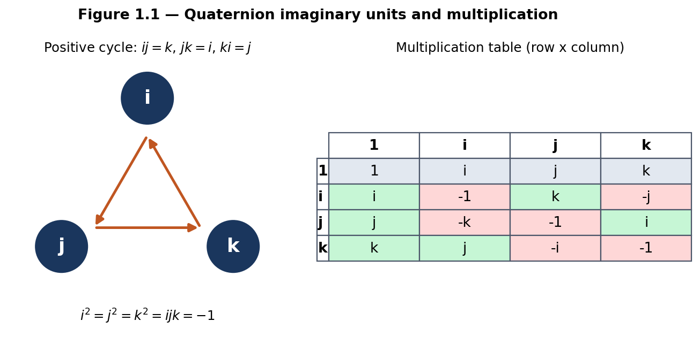
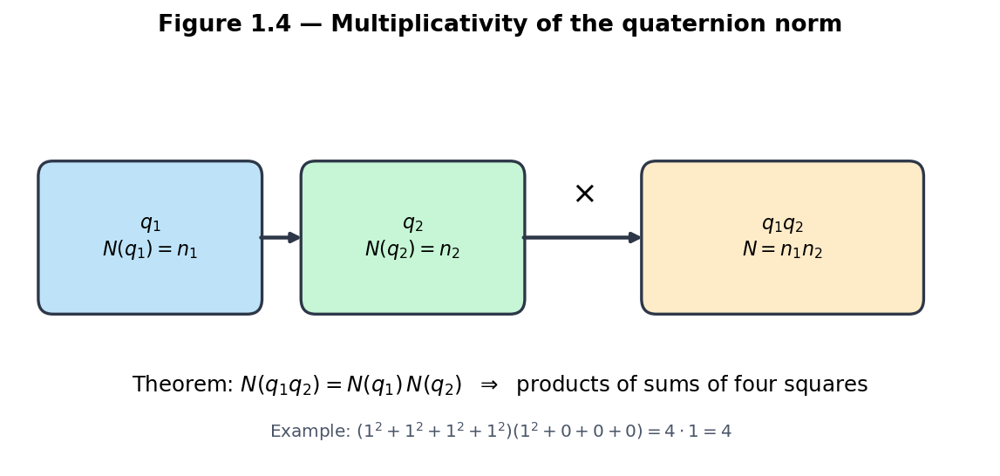
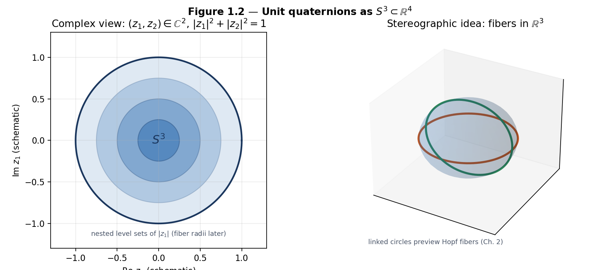
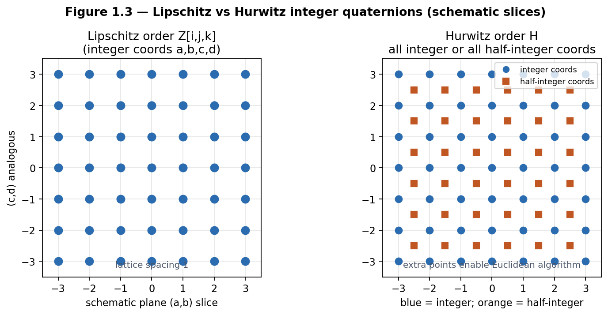
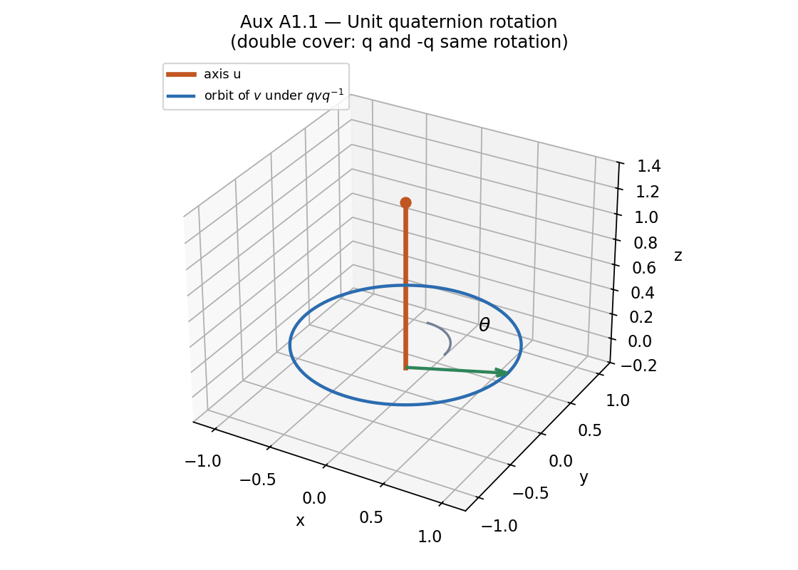

# Chapter 1 — Quaternions: Algebra, Geometry, and Arithmetic

This chapter builds the algebraic and geometric language used everywhere later in the book. Chapter 2 fibers the unit sphere of quaternions; Chapters 3–4 act on it by left and right multiplication; later chapters repeatedly invoke norms, integer orders, and the four-square theorem.

**Learning goals**

1. Master the algebraic rules and geometric interpretation of quaternions.  
2. See unit quaternions as the three-sphere \(S^3\).  
3. Distinguish Lipschitz and Hurwitz orders and understand why the latter is preferred for arithmetic.  
4. Re-encounter the four-square theorem as a consequence of norm multiplicativity.  
5. Meet the double-cover relationship to three-dimensional rotations.  
6. Run first computational labs with `kingdom.core.quaternion`.

**Figures in this chapter**

| Tag | File | Role |
|-----|------|------|
| Fig. 1.1 | `figures/fig1_1_ijk_multiplication.png` | \(i,j,k\) cycle and multiplication table |
| Fig. 1.2 | `figures/fig1_2_s3_unit_quaternions.png` | Unit quaternions as \(S^3\subset\mathbb{R}^4\) |
| Fig. 1.3 | `figures/fig1_3_lipschitz_hurwitz.png` | Lipschitz vs Hurwitz lattice (schematic) |
| Fig. 1.4 | `figures/fig1_4_norm_multiplicativity.png` | Norm multiplicativity → four squares |
| Aux A1.1 | `figures/aux1_1_quaternion_rotation.png` | Rotation via \(v\mapsto qvq^{-1}\) (→ Ch. 2) |

**Claim discipline**

| Claim | Type |
|-------|------|
| Algebra of \(\mathbb{H}\); \(N(q_1 q_2)=N(q_1)N(q_2)\); four-square theorem; \(\mathrm{Spin}(3)\to SO(3)\) double cover | **Theorem** (classical) |
| Preferring the Hurwitz order as the primary integer lattice for later flux/lattice work | **Model** choice |
| Kingdom Come / `flux_hopf_lib` APIs and demos | Software facts |

---

## 1.1 Definition and basic operations

### The algebra \(\mathbb{H}\)

A **quaternion** is an expression
\[
q = a + bi + cj + dk,
\]
where \(a,b,c,d\in\mathbb{R}\) and the symbols \(i,j,k\) satisfy Hamilton’s rules
\[
i^2 = j^2 = k^2 = ijk = -1.
\]
These force the cyclic products
\[
ij = k,\quad jk = i,\quad ki = j
\]
and the anticyclic products
\[
ji = -k,\quad kj = -i,\quad ik = -j.
\]
In particular, multiplication is **associative** and **distributive** over addition, but **not commutative**: \(ij\neq ji\).

As a real vector space,
\[
\mathbb{H} \;\cong\; \mathbb{R}^4,
\]
with basis \(\{1,i,j,k\}\). Addition and scalar multiplication are componentwise. The interesting structure is the bilinear product determined by the table above.



*Figure 1.1.* Left: the positive cycle \(i\to j\to k\to i\). Right: the \(4\times 4\) multiplication table for \(\{1,i,j,k\}\). Red-tinted cells are negative results; green-tinted cells are the pure imaginary basis elements.

**Notation.** We write \(q = (a,b,c,d)\) or \(q = a + \mathbf{v}\) with vector part \(\mathbf{v}=(b,c,d)\in\mathbb{R}^3\). Kingdom Come stores components as `(w, x, y, z)` with \(w=a\) the real part—the same convention as `flux_hopf_lib.quaternion.core.Quaternion`.

### Explicit product formula

If \(q_1 = a_1 + b_1 i + c_1 j + d_1 k\) and \(q_2 = a_2 + b_2 i + c_2 j + d_2 k\), then
\begin{align*}
q_1 q_2
&=
(a_1 a_2 - b_1 b_2 - c_1 c_2 - d_1 d_2)\\
&\quad+ (a_1 b_2 + b_1 a_2 + c_1 d_2 - d_1 c_2)\, i\\
&\quad+ (a_1 c_2 - b_1 d_2 + c_1 a_2 + d_1 b_2)\, j\\
&\quad+ (a_1 d_2 + b_1 c_2 - c_1 b_2 + d_1 a_2)\, k.
\end{align*}
This is exactly the formula implemented by `Quaternion.multiply` in both `flux_hopf_lib` and `kingdom.core.quaternion`.

### Complex pairs

Identifying \(\mathbb{C}\) with \(\mathrm{span}_{\mathbb{R}}\{1,i\}\) inside \(\mathbb{H}\), every quaternion can be written uniquely as
\[
q = z_1 + z_2\, j,\qquad z_1,z_2\in\mathbb{C},
\]
or as a pair \((z_1,z_2)\in\mathbb{C}^2\). This view is the natural bridge to the Hopf map in Chapter 2.

---

## 1.2 Conjugation and the multiplicative norm

### Conjugate

The **conjugate** of \(q = a + bi + cj + dk\) is
\[
\overline{q} = a - bi - cj - dk.
\]
Properties (all **Theorems**, elementary verifications):
\[
\overline{\overline{q}} = q,\qquad
\overline{q_1 + q_2} = \overline{q_1}+\overline{q_2},\qquad
\overline{q_1 q_2} = \overline{q_2}\,\overline{q_1}.
\]
Note the **order reversal** under conjugation of products—the noncommutative analogue of the complex rule \(\overline{zw}=\overline{z}\,\overline{w}\).

### Norm

The **(Euclidean) norm** is
\[
N(q) \;:=\; q\,\overline{q}
\;=\; a^2 + b^2 + c^2 + d^2
\;=\; |q|^2
\]
if one writes \(|q|\) for the Euclidean length in \(\mathbb{R}^4\). In code, `Quaternion.norm()` returns \(\sqrt{N(q)}=|q|\); the multiplicative quantity used in number theory is \(N(q)=|q|^2\). We will say **multiplicative norm** for \(N(q)\) and **length** for \(|q|\) when both appear.

**Theorem (multiplicativity of the norm).** For all \(q_1,q_2\in\mathbb{H}\),
\[
N(q_1 q_2) = N(q_1)\, N(q_2).
\]
*Sketch.* \(N(q_1 q_2)=(q_1 q_2)\overline{(q_1 q_2)}=q_1 q_2 \overline{q_2}\,\overline{q_1}=q_1 N(q_2)\overline{q_1}=N(q_1)N(q_2)\), using that \(N(q_2)\) is real (hence central).



*Figure 1.4.* The product of two quaternions multiplies their norms. Every identity among sums of four squares is, at bottom, this theorem in arithmetic clothing.

### Inverse

If \(q\neq 0\), then
\[
q^{-1} = \frac{\overline{q}}{N(q)},
\]
so every nonzero quaternion is a unit in the division ring \(\mathbb{H}\). In floating-point code, `inverse()` divides by \(|q|^2\) and raises if \(|q|\) is near zero.

---

## 1.3 Unit quaternions and the identification \(S^3\subset\mathbb{H}\cong\mathbb{R}^4\)

### The three-sphere

The set of **unit quaternions** is
\[
\mathrm{Sp}(1)
\;:=\;
\{ q\in\mathbb{H} : N(q)=1 \}
\;=\;
S^3 \subset \mathbb{R}^4.
\]
It is a compact Lie group under quaternion multiplication (associative, identity \(1\), inverses \(\overline{q}\)).

Geometrically:

- As a manifold, \(S^3\) is the unit sphere in four-dimensional Euclidean space.  
- As a group, left (or right) multiplication by a fixed unit quaternion is an isometry of \(S^3\).  
- As a complex pair, unit length means \(|z_1|^2+|z_2|^2=1\).



*Figure 1.2.* Left: schematic of the constraint \(|z_1|^2+|z_2|^2=1\) via nested level sets of \(|z_1|\). Right: after stereographic projection \(S^3\setminus\{\mathrm{pt}\}\to\mathbb{R}^3\), great-circle fibers will appear as linked circles (Chapter 2; compare Figs. 0.1–0.2).

### Stereographic projection (preview)

Removing a point (classically \(-1\), or any fixed unit quaternion) and projecting to a tangent \(\mathbb{R}^3\) yields a global chart on \(S^3\setminus\{\mathrm{pt}\}\). Kingdom Come’s Hopf visualizer uses stereographic (or orthographic 2D) projections heavily; here we only need that **\(S^3\) is drawable** once a chart is chosen. The full Hopf fibration story—fibers, linking, base \(S^2\)—is Chapter 2.

### Normalization in software

`Quaternion.normalize()` returns \(q/|q|\) (or the identity if \(q\) is numerically zero). Portal methods that construct new quaternions return `type(self)` so subclass helpers such as `hopf_image()` survive `normalize()` and `multiply()`.

---

## 1.4 Integer quaternions: Lipschitz order vs Hurwitz order

### Lipschitz order

The **Lipschitz order** is the set of quaternions with integer coordinates:
\[
L \;:=\; \mathbb{Z}[i,j,k]
\;=\;
\{ a+bi+cj+dk : a,b,c,d\in\mathbb{Z} \}.
\]
It is a free \(\mathbb{Z}\)-module of rank \(4\), closed under multiplication, and contains the eight **Lipschitz units**
\[
\{\pm 1,\pm i,\pm j,\pm k\}.
\]
Norms of Lipschitz quaternions are nonnegative integers. Multiplicativity still holds, so products of sums of four integer squares are again such sums.

### Hurwitz order

The **Hurwitz order** \(\mathcal{H}\) consists of all quaternions whose coordinates are **either all integers or all half-integers**:
\[
\mathcal{H}
=
L \;\cup\;
\Bigl(\tfrac12 + \tfrac12 i + \tfrac12 j + \tfrac12 k + L\Bigr).
\]
Equivalently: \(a,b,c,d\in\mathbb{Z}\) or \(a,b,c,d\in\mathbb{Z}+\tfrac12\). This is still a ring (in fact a maximal order in the rational quaternion algebra \(\mathbb{H}_{\mathbb{Q}}\)), and it is **larger** than \(L\).

The unit group of \(\mathcal{H}\) has **24** elements—the binary tetrahedral group—including
\[
\pm 1,\;\pm i,\;\pm j,\;\pm k,\quad
\tfrac12(\pm 1\pm i\pm j\pm k)
\]
(all sign combinations). The extra units and lattice points make \(\mathcal{H}\) **Euclidean** with respect to the norm: for any \(q,d\in\mathcal{H}\) with \(d\neq 0\) there exist \(m,r\in\mathcal{H}\) with \(q = md + r\) and \(N(r)<N(d)\). That Euclidean property underwrites unique factorization phenomena used in classical proofs of the four-square theorem and in ideal theory (Chapter 9).



*Figure 1.3.* Left: integer lattice (Lipschitz), shown in a 2D schematic slice. Right: Hurwitz adds half-integer points (orange squares) when all four coordinates share the same half-integer type. The picture is only a slice—true lattice geometry lives in \(\mathbb{R}^4\).

### Why prefer Hurwitz later? (**Model**)

| Feature | Lipschitz \(L\) | Hurwitz \(\mathcal{H}\) |
|---------|-----------------|------------------------|
| Definition | Integer coords | Integer or half-integer coords |
| Units | 8 | 24 |
| Euclidean algorithm | fails in general | holds |
| Unique factorization flavor | weaker | stronger (classical) |
| Relation to four squares | works, clumsier proofs | clean norm arguments |

**Claim type: Model.** For the gauged Hopf lattice and flywheel arithmetic of Parts II–IV, this book **defaults to Hurwitz** (or to lattices containing \(\mathcal{H}\)) unless a section explicitly restricts to Lipschitz. That is a design choice aligned with classical quaternion number theory, not a theorem that Lipschitz is “wrong.”

**Open thread.** Discrete adjacency rules built on \(\mathcal{H}\) (or on unit spheres over \(\mathcal{H}\)) feed Open Problem 1 in Chapter 3.

---

## 1.5 The four-square theorem via norms

**Theorem (Lagrange).** Every natural number \(n\) is a sum of four integer squares:
\[
n = a^2 + b^2 + c^2 + d^2
\quad\text{for some }a,b,c,d\in\mathbb{Z}.
\]

**Quaternionic reading.** The statement is exactly: for every \(n\in\mathbb{N}\) there exists \(q\in L\) (Lipschitz) with \(N(q)=n\).

**Why multiplicativity matters.** Euler’s four-square identity is \(N(q_1 q_2)=N(q_1)N(q_2)\) written in coordinates. Therefore it suffices to prove the theorem for primes (or for \(n\) square-free) and multiply representations. Classical proofs then show every prime is a norm from \(\mathcal{H}\) (or handle \(2\) and primes \(1\bmod 4\) / \(3\bmod 4\) by standard casework). Full proofs appear in many number-theory texts; Appendix D will collect a sketch. For this chapter, the essential message is:

> Four squares are not an isolated curiosity—they are the **norm theory of integer quaternions**.

**Comparison with Hatcher.** Hatcher’s early chapters revolve around **two** squares and binary quadratic forms (Gaussian integers, topographs, class groups). Quaternions are the four-dimensional upgrade: the same geometric instinct (norms, units, lattices), one dimension higher. Chapter 5 will lift topographs themselves.

**Claim type: Theorem** (classical). No new proof is claimed here.

---

## 1.6 Quaternions as rotations: the double cover \(\mathrm{Spin}(3)\to SO(3)\)

### Conjugation action on pure imaginaries

Identify \(\mathbb{R}^3\) with the pure imaginary quaternions
\[
\mathrm{Im}\,\mathbb{H} = \{ bi + cj + dk : b,c,d\in\mathbb{R} \}.
\]
For a **unit** quaternion \(q\in S^3\) and \(v\in\mathrm{Im}\,\mathbb{H}\), set
\[
\rho_q(v) \;:=\; q\, v\, q^{-1} = q\, v\, \overline{q}.
\]
Then \(\rho_q(v)\) is again pure imaginary, and \(\rho_q\) is an orthogonal linear map of \(\mathbb{R}^3\) with determinant \(+1\). Thus we obtain a homomorphism
\[
\rho: S^3 \longrightarrow SO(3),\qquad q\mapsto \rho_q.
\]

### Axis–angle formula

If \(q = \cos(\theta/2) + \sin(\theta/2)\, u\) with unit pure imaginary \(u\) (i.e. \(u^2=-1\)), then \(\rho_q\) is rotation by angle \(\theta\) about the axis \(u\). This is the content of Rodrigues’ formula; Kingdom Come exposes both `Quaternion.from_axis_angle(axis, theta)` and `rodrigues_rotation`.



*Auxiliary Figure A1.1.* A vector \(v\) swept around an axis \(u\) under the conjugation action of a one-parameter family of unit quaternions. The same rotation arises from \(q\) and from \(-q\).

### The kernel is \(\{\pm 1\}\)

Clearly \(\rho_{-q}=\rho_q\), since \((-q)v(-q)^{-1}=qvq^{-1}\). In fact
\[
\ker\rho = \{\pm 1\},
\]
so \(\rho\) is a **2-to-1** covering homomorphism
\[
S^3 \;\cong\; \mathrm{Spin}(3) \;\longrightarrow\; SO(3).
\]
Topologically this is the unique nontrivial double cover of \(SO(3)\). Paths in \(SO(3)\) that rotate by \(2\pi\) lift to paths in \(S^3\) from \(q\) to \(-q\); only a \(4\pi\) rotation closes in the cover—the origin of spinorial sign changes in physics.

**Claim type: Theorem** (classical Lie theory / geometry).

**Forward link.** The same unit quaternions that rotate \(\mathbb{R}^3\) will, in Chapter 2, be points of the **total space** of the Hopf fibration. Left and right multiplications that preserve the fibration become the symmetry language of Chapters 3–4.

---

## 1.7 First computational examples and labs

The book’s companion API (thin portal layer over `flux_hopf_lib`) lives at:

```text
kingdom.core.quaternion.Quaternion
kingdom.core.quaternion.rodrigues_rotation
```

Core methods used in this chapter:

| Method / constructor | Role |
|----------------------|------|
| `Quaternion(w, x, y, z)` | \(w+xi+yj+zk\) |
| `.multiply(other)` | Hamilton product |
| `.conjugate()`, `.inverse()`, `.normalize()` | algebra |
| `.norm()` | length \(\lvert q\rvert=\sqrt{N(q)}\) |
| `.from_axis_angle(axis, theta)` | unit quaternion for a rotation |
| `.as_array()` / `.from_array` (upstream) | NumPy interop |
| `.chordal_distance(other)` (upstream) | distance on \(S^3\) with \(q\sim -q\) option |
| `.hopf_image()`, `.from_hopf_coords(...)` | **preview of Ch. 2** — optional here |

### Lab 1.A — Multiplication table by machine

Construct \(i=(0,1,0,0)\), \(j=(0,0,1,0)\), \(k=(0,0,0,1)\) and verify \(ij=k\), \(ji=-k\), \(i^2=-1\).

```python
from kingdom.core.quaternion import Quaternion

i = Quaternion(0, 1, 0, 0)
j = Quaternion(0, 0, 1, 0)
k = Quaternion(0, 0, 0, 1)
print(i.multiply(j))  # ~ (0,0,0,1) = k
print(j.multiply(i))  # ~ (0,0,0,-1) = -k
print(i.multiply(i))  # ~ (-1,0,0,0)
```

### Lab 1.B — Norm multiplicativity

```python
import numpy as np
from kingdom.core.quaternion import Quaternion

rng = np.random.default_rng(0)
def rand_q():
    a = rng.normal(size=4)
    return Quaternion(*a)

q1, q2 = rand_q(), rand_q()
prod = q1.multiply(q2)
n1 = q1.norm() ** 2
n2 = q2.norm() ** 2
np_ = prod.norm() ** 2
print(n1, n2, np_, abs(np_ - n1 * n2))
```

Expect a residual on the order of \(10^{-14}\) or better.

### Lab 1.C — Lipschitz norms and four squares

Enumerate small Lipschitz quaternions and collect the set of norms \(N(q)=w^2+x^2+y^2+z^2\) for \(|w|,|x|,|y|,|z|\le N_{\max}\). Check that every integer from \(0\) to some bound appears (Lagrange guarantees eventual completeness; your bound is a computational observation).

### Lab 1.D — Double cover

```python
import numpy as np
from kingdom.core.quaternion import Quaternion

q = Quaternion.from_axis_angle(np.array([0.0, 0.0, 1.0]), np.pi / 3)
mq = Quaternion(-q.w, -q.x, -q.y, -q.z)
# conjugation action on a pure vector v = (0,1,0,0) ~ i
v = Quaternion(0, 1, 0, 0)
rq = q.multiply(v).multiply(q.inverse())
rm = mq.multiply(v).multiply(mq.inverse())
print(rq, rm)  # same rotated pure quaternion
```

### Lab 1.E — Optional Hopf peek

```python
q = Quaternion.from_hopf_coords(eta=0.3, xi1=0.1, xi2=0.5)
print(q.norm())       # ~ 1
print(q.hopf_image()) # point on S^2
```

Treat this as a **preview**, not a substitute for Chapter 2.

---

## Exercises

**1.A (hand).** Expand \((a+bi+cj+dk)(e+fi+gj+hk)\) and match the formula in §1.1.

**1.B (hand).** Prove \(\overline{q_1 q_2}=\overline{q_2}\,\overline{q_1}\) from the multiplication table (or from the explicit formula).

**1.C (hand).** Show that \(N(q)=q\overline{q}\) is real and nonnegative, and that \(N(q)=0\Leftrightarrow q=0\).

**1.D (hand).** Verify that the 24 Hurwitz units listed in §1.4 all have norm \(1\). How many Lipschitz units are among them?

**1.E (hand / reading).** Using multiplicativity, show that if \(n=N(q_1)\) and \(m=N(q_2)\) then \(nm=N(q_1 q_2)\). Explain in one sentence why this reduces Lagrange’s theorem to representing primes.

**1.F (hand).** Let \(q=\cos(\theta/2)+\sin(\theta/2)\,i\). Compute \(q\, j\, \overline{q}\) and identify the rotation in the \(jk\)-plane.

**1.G (code).** Complete Labs 1.A–1.D. Submit residuals for Lab 1.B and a printed set of norms for Lab 1.C with \(N_{\max}=3\).

**1.H (code).** Using `chordal_distance` (upstream) or \(\min(|q-r|,|q+r|)\), verify numerically that \(q\) and \(-q\) are close in the rotation sense even when far in \(\mathbb{R}^4\).

**1.I (Hatcher bridge).** In Hatcher, sums of two squares and Gaussian integers organize binary quadratic forms. Write three sentences mapping: (Gaussian integers \(\leftrightarrow\) Lipschitz/Hurwitz), (complex modulus \(\leftrightarrow\) quaternion norm), (unit circle \(S^1\) \(\leftrightarrow\) unit quaternions \(S^3\)).

**1.J (forward).** Without reading Chapter 2, guess: if unit quaternions are points of \(S^3\), what might a natural map \(S^3\to S^2\) do to a whole circle of phases? (You will check your guess against the Hopf map next.)

---

## Code and asset pointers

```text
kingdom.core.quaternion.Quaternion
kingdom.core.quaternion.rodrigues_rotation
flux_hopf_lib.quaternion.core.Quaternion   # upstream implementation
flux_hopf_lib.quaternion.core.q_mult, q_conj, q_normalize
```

**Figures:** generated for this chapter under `book/figures/fig1_*` and `aux1_1_*` (see `FIGURES.md`).  
**Related portal:** Gradio rotation intuition is secondary here; Hopf Visualizer becomes primary in Chapter 2.

---

## Looking ahead

With the algebraic and geometric language of quaternions in hand—product, conjugate, norm, \(S^3\), Hurwitz arithmetic, and the double cover of \(SO(3)\)—we are ready to **fiber** \(S^3\) over \(S^2\) in Chapter 2. The same unit quaternions will reappear as total-space points; their left and right multiplications will become the symmetries of the gauged Hopf lattice in Part II.

---

*Part I, Chapter 1 draft. Figures: generated diagrams in `book/figures/`.*
