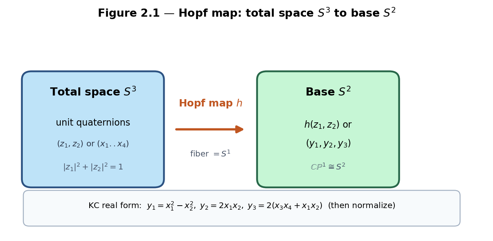
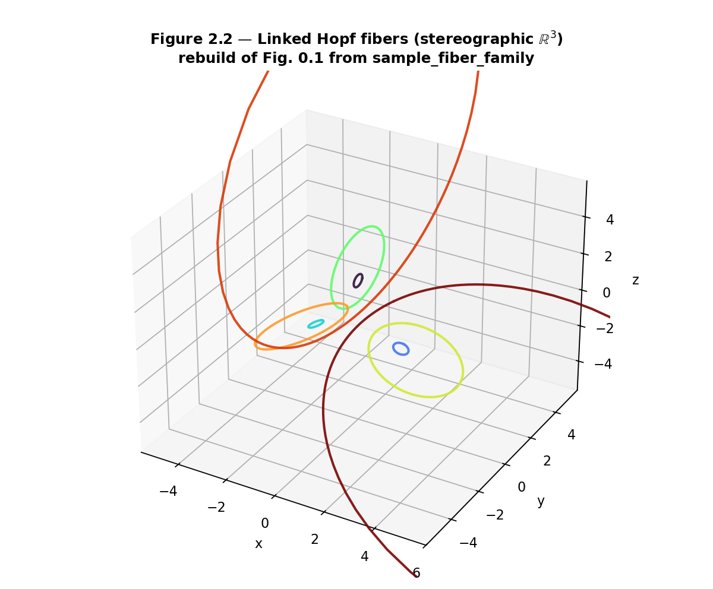
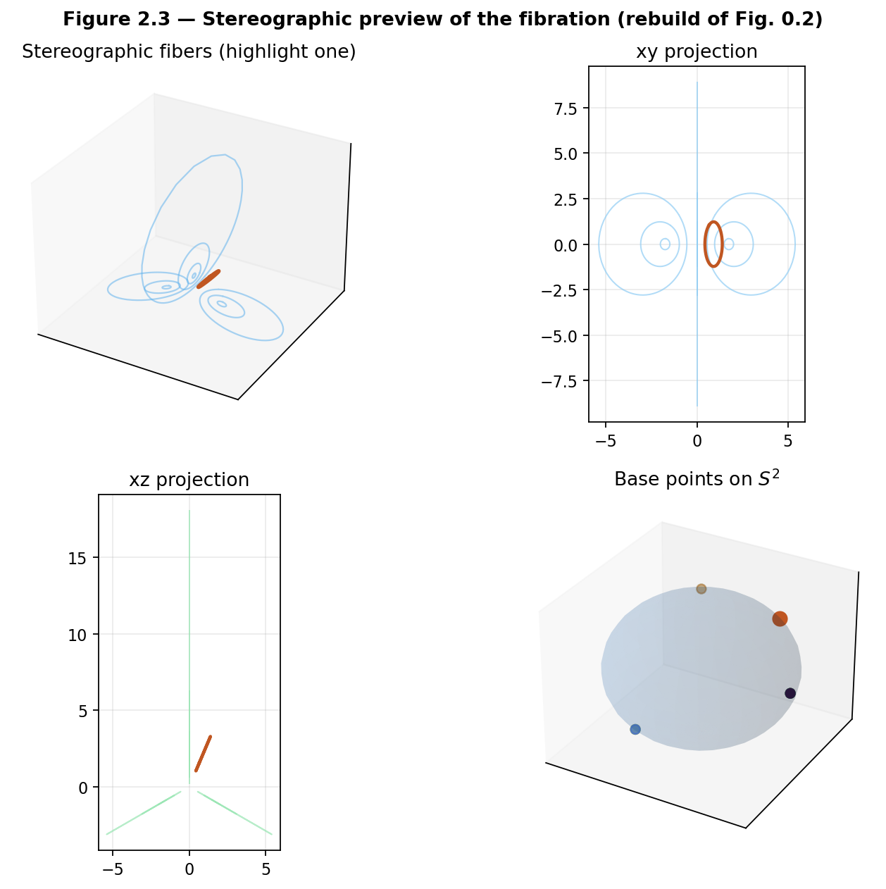
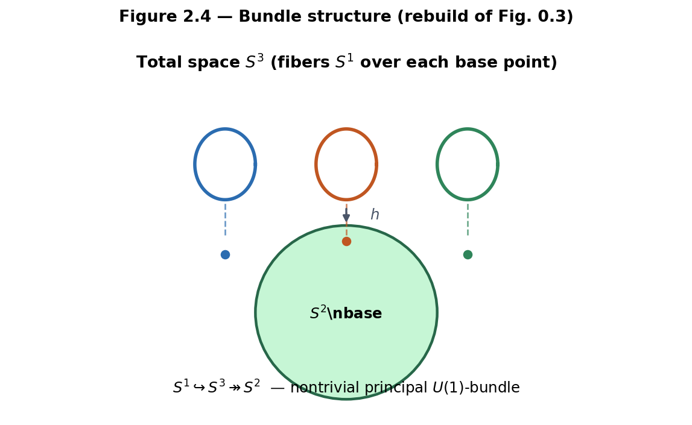
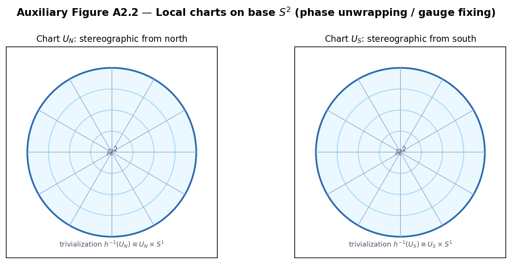
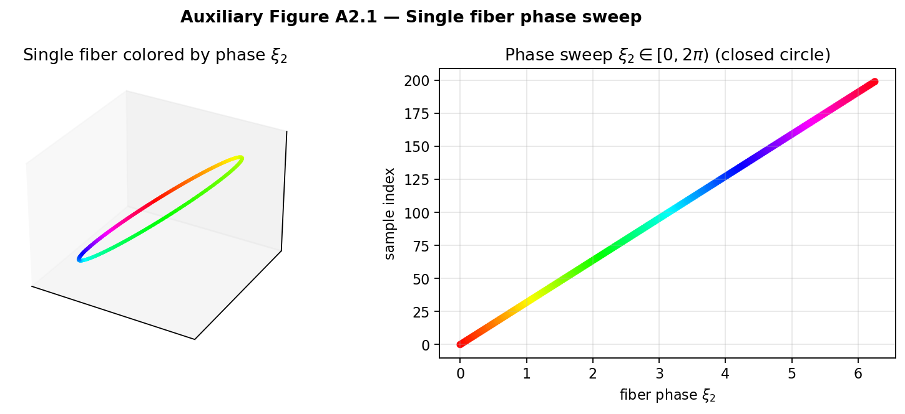

# Chapter 2 — The Hopf Fibration

This chapter defines the Hopf fibration from first principles and rebuilds the visual intuition of Figures 0.1–0.3. The same unit quaternions introduced in Chapter 1 become the total space \(S^3\). Left and right multiplications on this total space will become the symmetry language of the gauged Hopf lattice in Chapters 3–4.

**Learning goals**

1. Define the Hopf fibration in both complex-pair and real four-vector coordinates.  
2. Understand the fibers as circles and see their linking (Hopf invariant \(1\)).  
3. Work with stereographic projections and the visualizations used throughout the book.  
4. Recognize the bundle structure and basic charts.  
5. Connect the fibration back to unit quaternions and forward to the discrete lattice.  
6. Run labs with `kingdom.core.hopf` and the Gradio Hopf Visualizer.

**Figures in this chapter**

| Tag | File | Role |
|-----|------|------|
| Fig. 2.1 | `figures/fig2_1_hopf_definition.png` | Hopf map diagram (total space → base) |
| Fig. 2.2 | `figures/fig2_2_linked_fibers.png` | Linked Hopf fibers (stereographic) — rebuild of Fig. 0.1 |
| Fig. 2.3 | `figures/fig2_3_stereographic_preview.png` | Multi-panel stereographic preview — rebuild of Fig. 0.2 |
| Fig. 2.4 | `figures/fig2_4_bundle_structure.png` | Total space → base with fibers — rebuild of Fig. 0.3 |
| Aux A2.1 | `figures/aux2_1_fiber_phase_sweep.png` | Single fiber phase sweep |
| Aux A2.2 | `figures/aux2_2_hopf_charts.png` | Local charts on base \(S^2\) |

**Claim discipline**

| Claim | Type |
|-------|------|
| Hopf fibration definition, fiber structure, linking (Hopf invariant \(=1\)); double cover \(\mathrm{Spin}(3)\to SO(3)\) from Ch. 1 | **Theorem** (classical differential topology / geometry) |
| Interpreting the Hopf fibration as a higher-dimensional “Farey analogue” for the gauged lattice | **Model** |
| Kingdom Come visualizations and `kingdom.core.hopf` / `flux_hopf_lib` implementations | **Software fact** |

---

## 2.1 Definition of the Hopf fibration

### Complex-pair form (standard in the literature)

Identify unit quaternions with pairs of complex numbers (Chapter 1):
\[
q = z_1 + z_2\, j \quad \longleftrightarrow \quad (z_1, z_2) \in \mathbb{C}^2,
\qquad |z_1|^2 + |z_2|^2 = 1.
\]
One classical form of the **Hopf map** \(h: S^3 \to S^2\) is
\[
h(z_1, z_2)
=
\bigl(
  |z_1|^2 - |z_2|^2,\;
  2\,\mathrm{Re}(\overline{z_1} z_2),\;
  2\,\mathrm{Im}(\overline{z_1} z_2)
\bigr)
\in S^2 \subset \mathbb{R}^3,
\]
or, equivalently, the projectivized ratio
\[
[z_1 : z_2] \in \mathbb{CP}^1 \cong S^2.
\]
The second description makes the **circle fiber** obvious: multiplying \((z_1,z_2)\) by a common phase \(e^{i\phi}\) does not change the projective point.

### Real four-vector form (Kingdom Come / `flux_hopf_lib`)

For a unit 4-vector \((x_1,x_2,x_3,x_4)\in S^3\), the library implements
\begin{align*}
y_1 &= x_1^2 - x_2^2,\\
y_2 &= 2\, x_1 x_2,\\
y_3 &= 2\,(x_3 x_4 + x_1 x_2),
\end{align*}
followed by Euclidean normalization so that \((y_1,y_2,y_3)\in S^2\). Quaternion components are identified as
\[
(w,x,y,z) \;\equiv\; (x_1,x_2,x_3,x_4).
\]
This is the form documented in Kingdom Come’s theory notes and used by `hopf_map`, `hopf_map_quaternion`, and `Quaternion.hopf_image()`.

**Convention note (software vs textbook).** The classical complex form and the portal’s real four-vector formula are **both** maps \(S^3\to S^2\) in the Hopf family of constructions, but they need not agree componentwise under a fixed identification of \(\mathbb{R}^3\) coordinates. Labs in this chapter treat the **library formula as the working computational standard** for Kingdom Come continuity, while the complex \(\mathbb{CP}^1\) description remains the cleanest **Theorem**-level definition of fibers (common phase \(e^{i\phi}\)). When proving linking or Hopf invariant \(1\), use the classical bundle; when plotting portal-compatible curves, use `sample_fiber` / `hopf_map`.

**Angle coordinates.** The library also uses Hopf angles \((\eta,\xi_1,\xi_2)\) via `hopf_coordinates`:
\begin{align*}
x_1 &= \cos\eta\,\cos\xi_1, &
x_2 &= \cos\eta\,\sin\xi_1,\\
x_3 &= \sin\eta\,\cos\xi_2, &
x_4 &= \sin\eta\,\sin\xi_2,
\end{align*}
with \(\eta\in[0,\pi/2]\) (or a practical subrange) and \(\xi_1,\xi_2\in[0,2\pi)\). Fixing \((\eta,\xi_1)\) and sweeping \(\xi_2\) traces a **fiber**.



*Figure 2.1.* From total space \(S^3\) (unit quaternions) to base \(S^2\). The map is smooth and surjective; every base point has a circle’s worth of preimages.

**API note (Software fact).** Call signatures in code are component-wise, not “pass a Quaternion object” to `hopf_map`:

```text
hopf_map(x1, x2, x3, x4)           → (y1, y2, y3)
hopf_map_quaternion(w, x, y, z)    → (y1, y2, y3)
Quaternion(...).hopf_image()       → (y1, y2, y3)
```

---

## 2.2 Fibers and linking

### Fibers are circles

Over each point \(p\in S^2\) the preimage \(h^{-1}(p)\) is diffeomorphic to a circle \(S^1\). In angle coordinates, that circle is parametrized by the fiber phase \(\xi_2\) at fixed base coordinates \((\eta,\xi_1)\). In the complex picture, it is the \(U(1)\) action
\[
(z_1,z_2) \;\longmapsto\; (e^{i\phi} z_1,\; e^{i\phi} z_2).
\]

### Linking and the Hopf invariant

Any two distinct fibers are **linked exactly once** in \(S^3\). After stereographic projection to \(\mathbb{R}^3\), this appears as linked Villarceau circles on nested tori. The classical **Hopf invariant** of the map \(h: S^3\to S^2\) equals \(1\).

Linking is the topological feature that later underwrites **topological protection** of flux configurations on the gauged lattice: continuous deformations that preserve the fiber structure cannot unlink configurations without a cut or a singular transition.



*Figure 2.2.* Rebuild of Figure 0.1, generated from `sample_fiber_family`. Several fibers after stereographic projection \(S^3\setminus\{\mathrm{pt}\}\to\mathbb{R}^3\). Linking cannot be undone by continuous deformation without cutting a fiber.

**Claim type: Theorem.** Fiber structure and Hopf invariant \(=1\) are classical results in differential topology.

**Software diagnostics.** The library exposes linking helpers (`linking_number_pair`, `fiber_linking_number`, `fiber_pair_diagnostics`) for numerical checks on sampled curves—useful in labs, not substitutes for the classical theorem.

---

## 2.3 Stereographic projections and visualizations

### Projection formula

Kingdom Come / `flux_hopf_lib` use a stereographic chart with pole related to the fourth coordinate (TOE-compatible convention):
\[
(x_1,x_2,x_3,x_4)
\;\longmapsto\;
\Bigl(
  \frac{s\, x_2}{1-x_4},\;
  \frac{s\, x_3}{1-x_4},\;
  \frac{s\, x_1}{1-x_4}
\Bigr),
\]
with default scale \(s=2\) (`stereographic_project`). Fibers map to closed curves in \(\mathbb{R}^3\).

### Portal layout

The Gradio **Hopf Visualizer** defaults to multi-panel **2D** views (xy, xz, phase map, \(S^2\) base markers) for CPU-only hosts, with optional 3D WebGL modes locally. That multi-panel layout is the live counterpart of Figure 2.3.



*Figure 2.3.* Rebuild of Figure 0.2. Composed stereographic fibers, planar projections, and base points on \(S^2\), with one fiber highlighted—the same visual language as the portal’s Classic Hopf preset.

**Sampling API (Software fact).** `sample_fiber(eta, xi1, n_points=...)` returns a **dictionary**, not a bare list of quaternions:
\[
\{\texttt{eta},\;\texttt{xi1},\;\texttt{xi2},\;
\texttt{x1..x4},\;\texttt{y1..y3},\;
\texttt{px,py,pz},\;
\texttt{base\_y1..base\_y3},\;\ldots\}.
\]
`sample_fiber_family(...)` returns a list of such dictionaries over a spread of base points.

---

## 2.4 Bundle structure and charts

### Fiber bundle

The Hopf fibration is a fiber bundle
\[
S^1 \;\hookrightarrow\; S^3 \;\twoheadrightarrow\; S^2.
\]
It is the canonical example of a nontrivial principal \(U(1)\)-bundle (equivalently, an \(S^1\)-bundle). Locally it is a product \(U\times S^1\); globally the twisting produces the linking of fibers.



*Figure 2.4.* Rebuild of Figure 0.3. Conceptual diagram of the bundle structure that Chapter 3 will **discretize**: lattice points in the total space, Hopf projection to the base, adjacency and gauge along fibers.

### Local charts on the base

The base \(S^2\) is covered by the usual stereographic charts (north and south). Over each chart \(U\subset S^2\) there is a local trivialization
\[
h^{-1}(U) \;\cong\; U \times S^1,
\]
so a fiber coordinate (phase) can be chosen continuously on \(U\). Crossing from one chart to another changes the phase by a transition function valued in \(U(1)\)—the seed of **gauge** language for Part II.



*Auxiliary Figure A2.2.* Schematic north/south charts on the base. Phase unwrapping and gauge fixing on the discrete lattice will live over such charts.

### Phase sweep along a fiber

Holding the base point fixed and varying the fiber phase is the continuous analogue of “walking in the fiber direction.” In Hatcher’s Farey world, continued-fraction paths walk along edges of a planar diagram; here the primitive closed walk is a fiber circle.



*Auxiliary Figure A2.1.* One fiber colored by phase \(\xi_2\in[0,2\pi)\). The path closes: a full sweep returns to the same unit quaternion (up to sampling).

**Model reminder.** Calling Hopf a higher-dimensional “Farey analogue” remains a **Model** metaphor until Chapter 3 axiomatizes discrete adjacency and mediants on the gauged lattice (Open Problem 1).

---

## 2.5 Connection to quaternions and rotations

### Every unit quaternion lies on exactly one fiber

The Hopf map partitions \(S^3\) into fibers. Chapter 1’s unit group \(\mathrm{Sp}(1)=S^3\) is therefore a circle bundle over \(S^2\).

### Left and right multiplications

If \(u\in S^3\) is fixed:

- **Left multiplication** \(q\mapsto uq\) is an isometry of \(S^3\). It maps fibers to fibers and induces a rotation of the base \(S^2\).  
- **Right multiplication** \(q\mapsto qu\) is also an isometry; its interaction with fibers is different (fiberwise phase and the classical identification of right \(U(1)\) with the structure group of the bundle, in the complex picture).

Together, left and right actions generate the symmetry repertoire we will **gauge** and discretize in Chapters 3–4. The double cover \(\mathrm{Spin}(3)\to SO(3)\) from §1.6 sits naturally here: directions in \(\mathbb{R}^3\) relate to the base, while the fiber phase is the extra spinorial degree of freedom.

**Claim type: Theorem** for the continuous group actions and bundle structure; **Model** for their later role as lattice gauge symmetries.

---

## 2.6 First computational labs

Core API: `kingdom.core.hopf` · **Appendix C §C.1**.

- **2.A** `Quaternion.hopf_image()` / `hopf_map_quaternion` — unit image on \(S^2\).
- **2.B** `sample_fiber` returns a **dict**; check unit length on \(S^3\).
- **2.C** Gradio Hopf Visualizer panels vs Figs. 2.2–2.3.
- **2.D–E** Phase sweep; `sample_fiber_family`.

```python
from kingdom.core.quaternion import Quaternion
q = Quaternion(0.5, 0.5, 0.5, 0.5).normalize()
print(q.hopf_image())
```


---

## Exercises

**2.A (hand).** On a few unit test points, compare the complex-pair formula for \(h(z_1,z_2)\) with the Kingdom Come real form \((y_1,y_2,y_3)\) under the identification \((x_1,x_2,x_3,x_4)=(w,x,y,z)\). Note any convention differences (component order, overall rotation of \(\mathbb{R}^3\)); the **bundle geometry** is what must agree.

**2.B (hand).** Argue that every point of \(S^2\) has a circle’s worth of preimages under the Hopf map, using either the \(\mathbb{CP}^1\) description or the \((\eta,\xi_1,\xi_2)\) coordinates.

**2.C (hand).** Prove that simultaneous phase rotation \((z_1,z_2)\mapsto(e^{i\phi}z_1,e^{i\phi}z_2)\) leaves the classical Hopf image invariant. Interpret this as motion along a fiber.

**2.D (code).** Complete Labs 2.A–2.B. For three random unit quaternions, print `hopf_image()` and confirm each image has Euclidean norm \(\approx 1\).

**2.E (code).** Sample one fiber with `n_points >= 64`. Confirm unit length in \(S^3\) and that the stereographic curve is a closed loop (small endpoint gap). Optionally compute a numerical linking diagnostic between two fibers from `sample_fiber_family`. Separately, implement a classical common-phase fiber \((e^{i\phi}z_1,e^{i\phi}z_2)\) and check that the **complex** Hopf image (or \(\mathbb{CP}^1\) ratio) is constant.

**2.F (visual).** In the Gradio Hopf Visualizer, switch between **Classic Hopf** and a custom phase sweep. In one paragraph, describe how the linked-fiber view (Fig. 2.2) emerges from the multi-panel layout (Fig. 2.3).

**2.G (Hatcher bridge).** In Hatcher, continued-fraction convergents trace zigzag paths on the Farey diagram. Guess (and later verify in Ch. 3) what the discrete analogue of “walking along a fiber” might be on the gauged Hopf lattice.

**2.H (forward).** Why might left and right multiplications by unit quaternions be natural candidates for the gauge symmetries of a lattice built on \(S^3\)? (Answered in Chapter 3.)

**2.I (connection to Ch. 1).** Using `from_axis_angle` and `hopf_image`, pick a one-parameter family of unit quaternions rotating about a fixed axis. Plot or tabulate how the Hopf image moves on \(S^2\). Relate to left multiplication acting on the base.

---

## Code and asset pointers

```text
kingdom.core.hopf                 # re-exports flux_hopf_lib.hopf
kingdom.core.quaternion           # .hopf_image, .from_hopf_coords
flux_hopf_lib.hopf.fibration      # hopf_map, sample_fiber, stereographic_project, ...
kingdom.viz.hopf_plotly           # multi-panel 2D / optional 3D
```

**Figures:** generated under `book/figures/fig2_*` and `aux2_*` via `scripts/generate_ch2_figures.py` (samples real fibers from `flux_hopf_lib` when available).  
**Related portal:** Hopf Visualizer tab — live counterpart of Figures 2.2–2.4 and Aux A2.1.  
**Chapter 0 assets:** Figs. 0.1–0.3 remain the narrative first look; Figs. 2.2–2.4 are the first-principles rebuilds.

---

## Looking ahead

The Hopf fibration supplies the geometric backbone: \(S^3\) as total space, \(S^2\) as base, and linked circle fibers as the primitive topological objects. In **Chapter 3** we discretize this picture by placing a lattice (built on the Hurwitz preference of Chapter 1) inside \(S^3\), projecting via the Hopf map, and defining adjacency and gauge actions. The same linking that makes the fibers topologically nontrivial will become the protection mechanism for **flux flywheels**.

With the algebraic language of quaternions and the bundle geometry of the Hopf fibration now in place, we are ready to construct the **gauged Hopf lattice**—the direct higher-dimensional lift of Hatcher’s Farey diagram.

---

*Manuscript · Part I · Chapter 2 · Figures in `book/figures/` · Labs: `kingdom.core.hopf`.*
