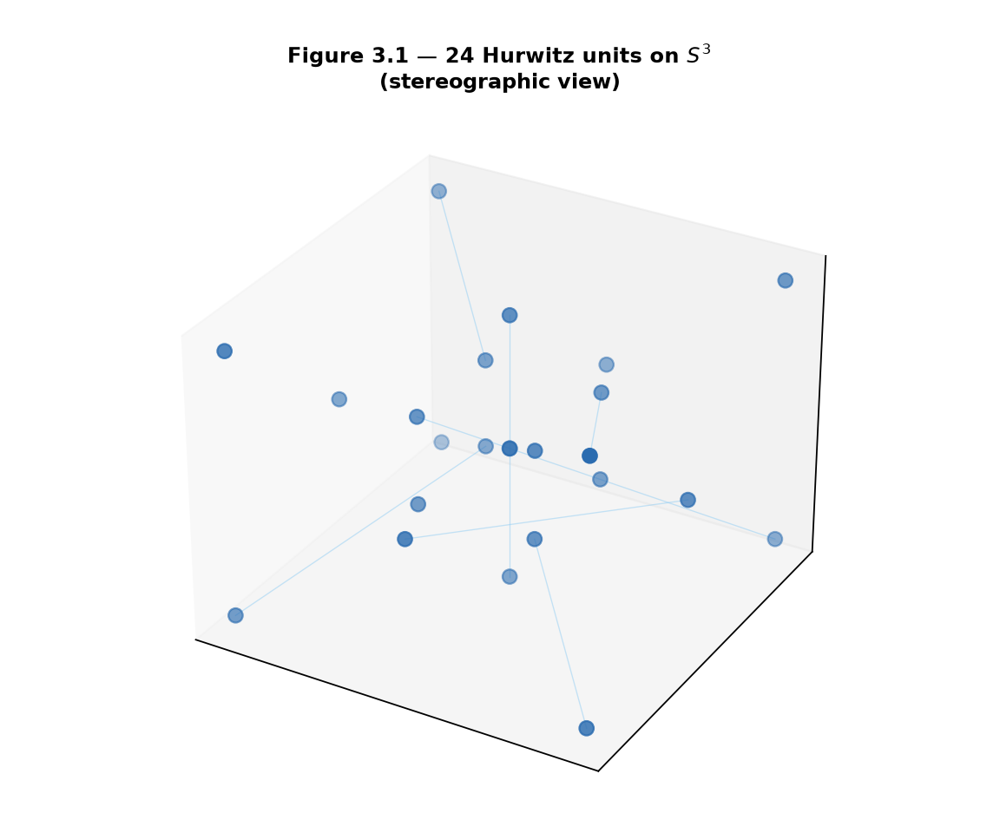
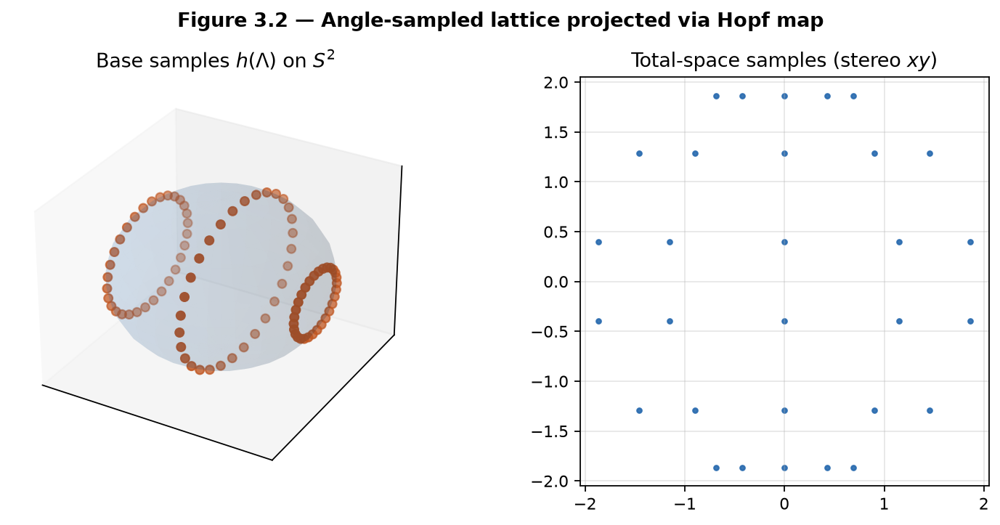
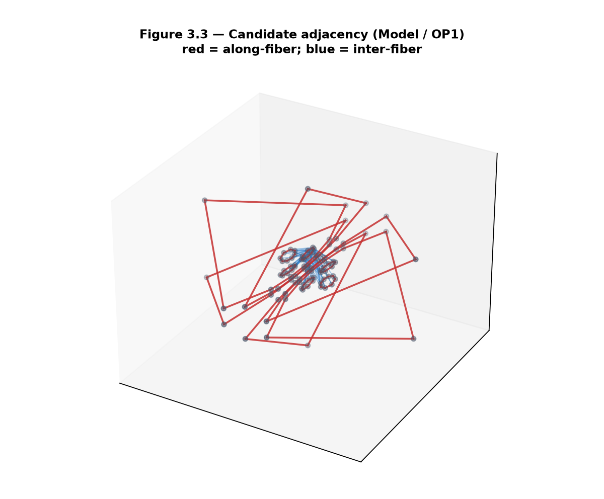
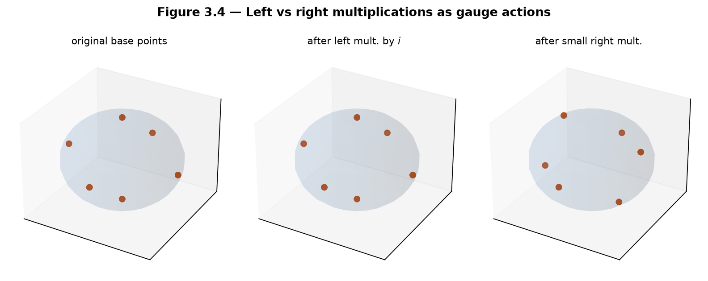
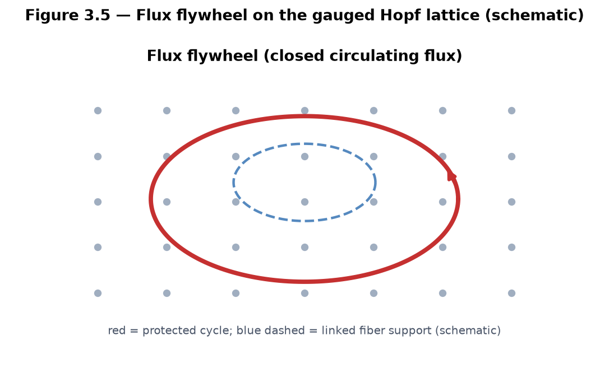

# Chapter 3 — Construction of the Gauged Hopf Lattice

This chapter discretizes the Hopf fibration. We place a lattice inside the total space \(S^3\) (built on the Hurwitz preference of Chapter 1), project it via the Hopf map of Chapter 2, and define adjacency and gauge actions. The resulting **gauged Hopf lattice** is the direct higher-dimensional analogue of Hatcher’s Farey diagram—**as a Model construction**, pending a uniqueness theorem (Open Problem 1). Left and right multiplications become gauge symmetries; linked fibers become the carriers of topological protection for flux configurations.

**Learning goals**

1. Construct discrete point sets inside \(S^3\) using Hurwitz units and denser samplings.  
2. Define the gauged Hopf lattice via Hopf projection and adjacency rules.  
3. Introduce mediant-like combination rules and discrete fiber walks.  
4. Define gauge fields and the first notion of flux on the lattice.  
5. Meet flux flywheels as topologically protected rotating configurations.  
6. State Open Problem 1 (canonical quaternionic Farey structure) with a clear research target.

**Figures in this chapter**

| Tag | File | Role |
|-----|------|------|
| Fig. 3.1 | `figures/fig3_1_hurwitz_lattice_in_s3.png` | 24 Hurwitz units on \(S^3\) (stereographic) |
| Fig. 3.2 | `figures/fig3_2_hopf_projected_lattice.png` | Angle-sampled lattice → base \(S^2\) |
| Fig. 3.3 | `figures/fig3_3_adjacency_and_fibers.png` | Candidate along-/inter-fiber adjacency |
| Fig. 3.4 | `figures/fig3_4_gauge_action.png` | Left/right multiplication as gauge actions |
| Fig. 3.5 | `figures/fig3_5_flux_flywheel_schematic.png` | Flux flywheel schematic |
| Aux A3.1 | `figures/aux3_1_lattice_simulator_still.png` | Two-gyro Lattice Simulator still |

**Claim discipline**

| Claim | Type |
|-------|------|
| Existence of the Hurwitz order, 24 units, Euclidean property (Ch. 1) | **Theorem** |
| Hopf fibration structure and linking (Ch. 2) | **Theorem** |
| Specific discrete adjacency / mediant rules; “the” gauged Hopf lattice as Farey lift | **Model** (Open Problem 1) |
| Flux flywheels as protected circulating configurations; dynamical two-gyro demos | **Model** + **Software fact** |
| `kingdom.core.lattice.LatticeConfig`, `kingdom.simulations.lattice.TwoGyroLattice`, book helper `qga/lib/hopf_lattice.py` | **Software fact** |

---

## 3.1 The Hurwitz lattice inside \(S^3\)

Chapter 1 established the **Hurwitz order** \(\mathcal{H}\) as the preferred integer lattice in \(\mathbb{H}\) (**Model** preference for later arithmetic; classical Euclidean properties are **Theorems**). Its 24 units form a finite group—the binary tetrahedral group—lying on the unit sphere:
\[
\Lambda_0
\;:=\;
\{ q\in\mathcal{H} : N(q)=1 \}
\;=\;
\mathcal{H}\cap S^3.
\]
Explicitly, the units are
\[
\{\pm 1,\pm i,\pm j,\pm k\}
\;\cup\;
\Bigl\{\tfrac12(\pm 1\pm i\pm j\pm k)\Bigr\}
\]
(all sign combinations in the second family).



*Figure 3.1.* The 24 Hurwitz units after stereographic projection to \(\mathbb{R}^3\). This is the smallest nontrivial discrete substrate for total-space geometry compatible with Chapter 1.

### Density beyond 24 points

A theory with only 24 sites is too sparse for Farey-style adjacency, continued-fraction walks, or continuum-like flux. We therefore work with **nested levels** of discreteness:

| Level | Object | Role |
|-------|--------|------|
| \(\Lambda_0\) | Hurwitz units (\(N=1\)) | Exact arithmetic skeleton; discrete gauge group |
| \(\Lambda_n\) | \(\{q/\lvert q\rvert : q\in\mathcal{H},\; N(q)=n\}\) (optional) | Norm shells; arithmetic depth (Ch. 9) |
| \(\Lambda_{\mathrm{ang}}\) | Samples of Hopf angles \((\eta,\xi_1,\xi_2)\) | Dense visualization / numerical OP1 tests |
| \(\Lambda_{\mathrm{dyn}}\) | Site quaternions in `TwoGyroLattice` | Dynamical Model used in the portal |

**Software fact.** The book helper `qga/lib/hopf_lattice.py` implements \(\Lambda_0\) and \(\Lambda_{\mathrm{ang}}\) for labs and figures. Kingdom Come’s live portal currently emphasizes \(\Lambda_{\mathrm{dyn}}\) (see §3.6).

---

## 3.2 The gauged Hopf lattice

### Projection via the Hopf map

Apply the Hopf map \(h: S^3\to S^2\) (Chapter 2) to a discrete set \(\Lambda\subset S^3\). The image \(h(\Lambda)\) is a discrete set of base points. Each fiber over those base points may contain multiple samples from \(\Lambda\) (phase discretization).



*Figure 3.2.* Left: base samples on \(S^2\). Right: total-space samples in a stereographic \(xy\) view. Generated from `sample_angle_lattice` + `hopf_project_points` in the book helper.

### Definition (working)

We define a **gauged Hopf lattice** as a tuple
\[
\bigl(\Lambda,\; h(\Lambda),\; E_{\parallel},\; E_{\perp},\; \mathcal{G}\bigr)
\]
where:

- \(\Lambda\subset S^3\) is a discrete point set (one of the levels above),  
- \(h(\Lambda)\) is its Hopf image on the base,  
- \(E_{\parallel}\) is the set of **along-fiber** edges (phase neighbors),  
- \(E_{\perp}\) is the set of **inter-fiber** edges (base-neighbor lifts),  
- \(\mathcal{G}\) is a group of **gauge transformations** acting on \(\Lambda\) (left/right multiplications by units, and continuous one-parameter subgroups in the dynamical Model).

### Adjacency rules (**Model** / OP1)

Two lattice points \(q_1,q_2\in\Lambda\) may be declared adjacent in either of two ways:

1. **Along-fiber (\(E_{\parallel}\)).** They lie on (approximately) the same Hopf fiber and are neighbors in discrete phase \(\xi_2\).  
2. **Inter-fiber (\(E_{\perp}\)).** Their base points \(h(q_1),h(q_2)\) are neighbors under a discrete rule on \(S^2\), and a lift to \(S^3\) is chosen (gauge condition).

A **mediant-like rule** would supply, for adjacent base points, a canonical “sum” or interpolant in the total space—exactly the quaternionic lift of Hatcher’s
\[
\frac{a}{c}\oplus\frac{b}{d}=\frac{a+b}{c+d}.
\]
No single such rule is yet proved canonical.



*Figure 3.3.* Red: along-fiber edges. Blue: inter-fiber edges from a **candidate** rule (angular nearest neighbors on the base after Hopf projection, plus phase neighbors). This is an experimental combinatorial object, not a theorem.

**Model note.** The adjacency relation is a design choice that *should* reduce to classical Farey adjacency under a suitable projection or restriction. That reduction (and uniqueness among reasonable choices) is **Open Problem 1**.

### Candidate rule used in figures and labs

The book helper implements one explicit candidate (`candidate_adjacency`):

- Recover rough \((\eta,\xi_1,\xi_2)\) from coordinates.  
- Along-fiber: close in \((\eta,\xi_1)\), neighboring in \(\xi_2\).  
- Inter-fiber: angular distance on \(S^2\) below a threshold; exclude along-fiber pairs.

Other candidates (spherical Delaunay on the base, Hurwitz-norm determinants, geodesic mediants, …) are welcome; record them against OP1.

---

## 3.3 Gauge actions: left and right multiplications

From Chapters 1–2:

- **Left multiplication** \(q\mapsto uq\) (unit \(u\)) is an isometry of \(S^3\), maps fibers to fibers, and induces a rotation of the base \(S^2\).  
- **Right multiplication** \(q\mapsto qu\) is an isometry; in the classical complex picture it implements fiberwise \(U(1)\) phase (structure-group action).

On a discrete set \(\Lambda\) we therefore equip two families of **gauge transformations**:

| Action | Continuous | Discrete (Hurwitz) |
|--------|------------|---------------------|
| Left | \(u\in S^3\) | \(u\in\Lambda_0\) (24 units) |
| Right | \(u\in S^3\) (esp. fiber \(U(1)\)) | \(u\in\Lambda_0\) |

When \(\Lambda=\Lambda_0\), left/right multiplications by units **permute** the lattice exactly. On denser samples they move points within \(S^3\); one may re-snap to nearest lattice points (another OP1 design choice).



*Figure 3.4.* Hopf images of the 24 Hurwitz units: original; after left multiplication by \(i\); after a small right multiplication (phase-like). Left multiplication by a Hurwitz unit **permutes** \(\Lambda_0\), so the multiset of base points is invariant even though individual assignments change (see Lab 3.C note and Ch. 4 Lab 4.A).

### Dynamical gauge in the portal (**Model** + software)

Kingdom Come’s `TwoGyroLattice` does not store a static Farey graph. It evolves \(n\) site quaternions with left/right rotors and a global **gauge rotation** driven by mean twist imbalance:
\[
q_i \;\leftarrow\; \delta_L\, q_i\, \overline{\delta_R},
\quad\text{then}\quad
q_i \;\leftarrow\; q_i\, g(\alpha),
\]
with gauge angle \(\alpha\) proportional to average twist. **Identity preservation** tracks how well a parallel-transported identity field stays aligned—stable vs chaotic modes differ mainly in `gauge_strength` and detuning. This is a **dynamical Model** of gauged flux, not yet a combinatorial Farey theory.

---

## 3.4 Flux configurations and flywheels (first introduction)

### Discrete flux

A **flux configuration** on the gauged Hopf lattice is an assignment of oriented edge weights
\[
\Phi: E_{\parallel}\cup E_{\perp} \to \mathbb{Z}
\]
(or to \(\mathbb{R}\), in continuum limits) that transforms naturally under gauge actions and satisfies a discrete conservation law at vertices (coboundary / Kirchhoff condition)—to be refined in Chapter 5 with topographs.

### Flux flywheel

A **flux flywheel** is a closed, topologically protected circulating flux configuration: a periodic orbit of gauge and phase that cannot unwind continuously without cutting a linked fiber or violating gauge constraints. In the continuous / dynamical limit these become the rotating flux structures of the Kingdom Come Model (Ch. 0, Fig. 0.4; portal Flux Flywheel tab).



*Figure 3.5.* Closed circulating flux (red) supported on lattice edges and fibers; a linked fiber (blue dashed) hints at the topological obstruction to trivialization.

**Claim type.** Existence and stability of flywheels as *physical* objects: **Model**. Linking of Hopf fibers as a classical topological fact: **Theorem** (Ch. 2). Mapping flywheels to atomic number \(Z\): later chapters (**Model** / **Hypothesis**).

---

## 3.5 Open Problem 1 — Canonical quaternionic Farey structure

**Open Problem 1 (core of this chapter and of Part II).**  
Prove uniqueness (or classify all reasonable choices) of discrete adjacency / mediant rules on the gauged Hopf lattice such that:

1. The structure **reduces to the classical Farey diagram** under a suitable projection or restriction (e.g. a fixed complex line, a parabolic subgroup, or a 2D slice of base coordinates).  
2. Adjacency is **compatible** with left and right gauge actions (equivariance).  
3. The resulting graph admits a natural notion of **continued-fraction paths** (discrete walks that refine approximants), including walks that advance primarily **along fibers**.  
4. (Optional but desirable.) A Euclidean or greedy algorithm on the lattice recovers shortest paths analogous to Farey mediants.

**Current status (draft).**

| Layer | Status |
|-------|--------|
| Hurwitz units \(\Lambda_0\) | Classical, settled |
| Hopf projection of discrete sets | Implemented (portal + book helper) |
| Candidate adjacency (`candidate_adjacency`) | Numerical experiments only — **not** proved canonical |
| Reduction to Farey \(\lvert ad-bc\rvert=1\) | **Open** |
| Equivariant mediant | **Open** |
| Dynamical two-gyro lattice | Portal demo; parallel track to combinatorial theory |

**Research target.** Any reader who solves or substantially advances Open Problem 1 produces the central combinatorial object of the entire book.

See also `notes/open_problems.md` (OP1 status tracking).

---

## 3.6 Software map and first computational labs

| Component | Location |
|-----------|----------|
| `LatticeConfig` | `kingdom.core.lattice` |
| `TwoGyroLattice` | `kingdom.simulations.lattice` |
| Hurwitz / adjacency / gauge | `lib/hopf_lattice.py` |

**Honest gap.** No production `build_hurwitz_lattice_sample` in Kingdom Come yet — pedagogy lives in `lib/`.

**Labs (short form).** Full code: **Appendix C §C.2**.

- **3.A** 24 Hurwitz units; Hopf project; count base points.
- **3.B** `sample_angle_lattice` + `candidate_adjacency` (OP1 sandbox).
- **3.C** Left \(	imes i\): base **set** invariant, total-space points move (see Lab 4.A).
- **3.D** `run_lattice_comparison` stable vs chaotic.
- **3.E** Toy `discrete_flux_cycle`.

```python
from lib.hopf_lattice import HURWITZ_UNITS, hopf_project_points
print(len(HURWITZ_UNITS), hopf_project_points(HURWITZ_UNITS).shape)
```


---

## Exercises

**3.A (hand).** List the 24 Hurwitz units and verify \(N(q)=1\) for each family (\(\pm 1,\pm i,\pm j,\pm k\) and half-integer units).

**3.B (hand).** In two sentences, describe how left multiplication by a fixed unit quaternion acts on the base \(S^2\) via the Hopf map.

**3.C (code).** Complete Labs 3.A–3.C. Report the number of approximate distinct base points for \(\Lambda_0\) and for one angle lattice. For Lab 3.C, confirm that the sorted base multiset is invariant under left multiplication by \(i\) while some index-wise base coordinates still move.

**3.D (code).** Apply a sequence of small right multiplications to \(\Lambda_0\) (or one fiber of \(\Lambda_{\mathrm{ang}}\)) and check approximate return after total angle \(2\pi\).

**3.E (visual / dynamical).** Run Lab 3.D (simulator) or the Gradio Lattice Simulator. Describe what “identity preservation” looks like for stable vs chaotic modes.

**3.F (Hatcher bridge).** In Hatcher, two fractions \(a/c\) and \(b/d\) are Farey-adjacent iff \(\lvert ad-bc\rvert=1\). Propose a quaternionic analogue (e.g. \(\lvert N(q_1\overline{q_2}-q_2\overline{q_1})\rvert\) or a \(2\times 2\) minor from complex pairs) and test it numerically on \(\Lambda_0\) or \(\Lambda_{\mathrm{ang}}\). Record whether it recovers a subgraph of `candidate_adjacency`.

**3.G (forward).** Why is topological linking of fibers a natural candidate for the protection mechanism of flux flywheels? (Developed in Chapters 5 and 10.)

**3.H (Open Problem 1 teaser).** Run the current `candidate_adjacency` implementation. Does it reduce to classical Farey adjacency under any obvious projection or 2D slice? Document one negative or partial observation—progress often starts as a failed reduction.

**3.I (software honesty).** In one paragraph, distinguish: (i) Hurwitz arithmetic lattice, (ii) angle-sampled visualization lattice, (iii) two-gyro dynamical lattice. Which claim types apply to each?

---

## Code and asset pointers

```text
# Book pedagogy (this repo)
qga/lib/hopf_lattice.py
  HURWITZ_UNITS, sample_angle_lattice, hopf_project_points,
  candidate_adjacency, left_multiply, right_multiply, discrete_flux_cycle

# Kingdom Come
kingdom.core.lattice.LatticeConfig
kingdom.simulations.lattice.TwoGyroLattice
kingdom.simulations.lattice.run_lattice_comparison
kingdom.simulations.lattice.build_lattice_figure
kingdom.core.hopf                    # projection / fibers
```

**Figures:** `scripts/generate_ch3_figures.py`  
**Related portal:** Lattice Simulator tab — dynamical counterpart of Aux A3.1.  
**Open problems:** `notes/open_problems.md` · OP1.

---

## Looking ahead

We now possess the discrete geometric object at the heart of the book: the **gauged Hopf lattice**, still with a **Model**-level adjacency rule pending OP1. In **Chapter 4** we study its symmetries in detail—the full gauge group generated by left and right actions, periodicity, and comparison with Hatcher’s linear fractional transformations. Chapters 5–7 develop flux topographs, classification, and the \(Z\mapsto\) flywheel map on this lattice.

When discrete **labels** later meet continuous geometry (digital roots, moduli, visual orbits), keep the discipline of **Chapter 9 §9.5**: algebraic cycle structure, sequential label progression, and true angle–label lock are *different* invariants—visual order is not statistical locking unless tested against a null. Full treatment and control: §9.5 · `notes/RESEARCH_NOTE_moduli.md` · supporting stack `vortex_math`.

With the gauged Hopf lattice constructed, we are ready to examine its symmetries—the higher-dimensional lift of the linear fractional transformations that organize Hatcher’s Farey diagram.

---

*Manuscript · Part II · Chapter 3 · Figures in `book/figures/` · Helpers: `lib/hopf_lattice.py` · OP1.*
