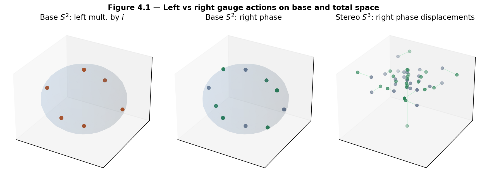
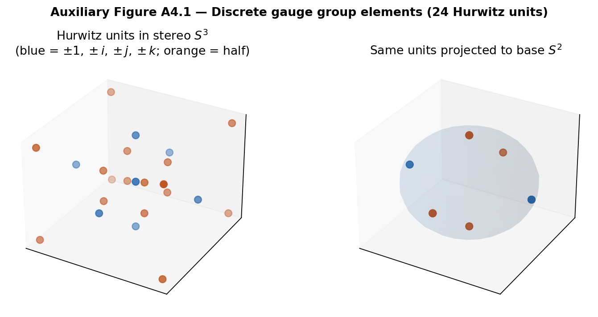
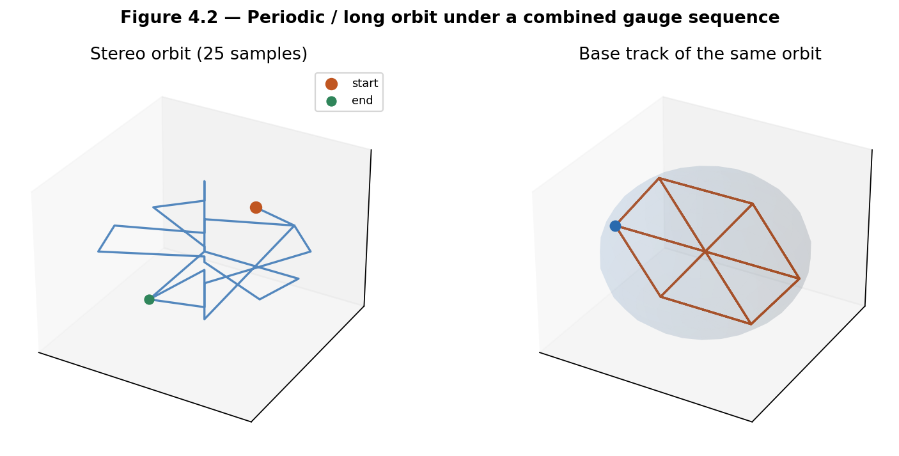
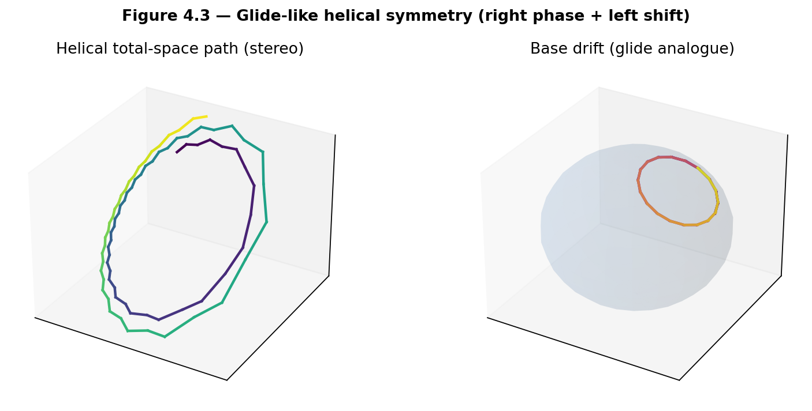
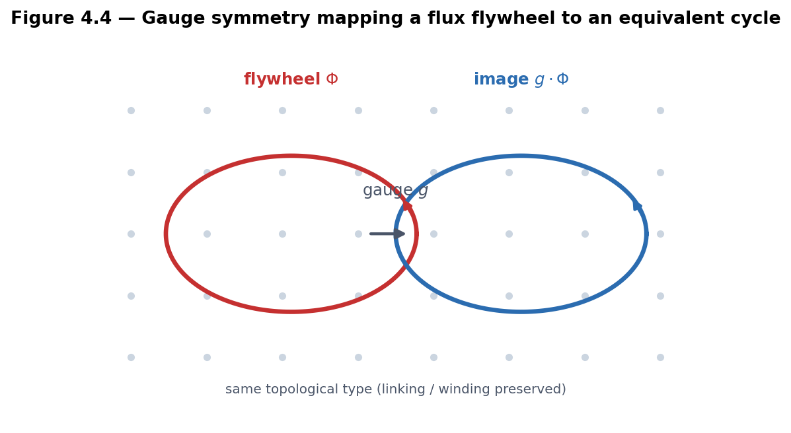

# Chapter 4 — Symmetries of the Gauged Hopf Lattice

This chapter examines the symmetries generated by left and right multiplications on the gauged Hopf lattice of Chapter 3. These actions play the role that linear fractional transformations play for Hatcher’s Farey diagram. We classify periodic structures, glide-like motions, and rotational symmetries, and see how the gauge group acts on flux configurations and flywheels.

**Learning goals**

1. Treat left and right multiplications as the fundamental gauge symmetries of the lattice.  
2. Compare the quaternionic gauge actions with Hatcher’s linear fractional transformations.  
3. Identify periodic orbits, glide-like actions, and rotational symmetries.  
4. Understand how symmetries act on flux configurations and preserve (or map) flywheels.  
5. Prepare the symmetry language required for flux topographs (Chapter 5).

**Figures in this chapter**

| Tag | File | Role |
|-----|------|------|
| Fig. 4.1 | `figures/fig4_1_left_right_symmetries.png` | Left vs right gauge actions on base and fibers |
| Fig. 4.2 | `figures/fig4_2_periodic_orbit.png` | Orbit under combined gauge sequence |
| Fig. 4.3 | `figures/fig4_3_glide_reflection_analogue.png` | Glide-like helical symmetry |
| Fig. 4.4 | `figures/fig4_4_symmetry_on_flywheel.png` | Gauge symmetry preserving a flux flywheel |
| Aux A4.1 | `figures/aux4_1_gauge_group_elements.png` | Discrete gauge elements (24 Hurwitz units) |

**Claim discipline**

| Claim | Type |
|-------|------|
| Left and right multiplications are isometries of \(S^3\); classical Hopf bundle structure group | **Theorem** |
| Discrete gauge actions as “the modular group of the lattice”; equivariance of candidate adjacency; glide analogues | **Model** (pending OP1) |
| Action of gauge on flux/flywheels in the combinatorial and dynamical Models | **Model** |
| `qga/lib/hopf_lattice.py` symmetry helpers; `TwoGyroLattice` gauge evolution | Software facts |

---

## 4.1 Left and right multiplications as gauge symmetries

Chapter 3 equipped the gauged Hopf lattice with two families of gauge transformations coming directly from quaternion multiplication:

- **Left multiplication** \(q \mapsto u q\) (fixed unit \(u\)) is an isometry of \(S^3\). It maps fibers to fibers and induces a rotation of the base \(S^2\) via the Hopf map.  
- **Right multiplication** \(q \mapsto q u\) is an isometry; in the classical complex picture it implements the fiberwise \(U(1)\) phase (the structure-group action of the bundle).

On a discrete set \(\Lambda\) these become the operational gauge symmetries.

| Domain | Left action | Right action |
|--------|-------------|--------------|
| \(\Lambda_0\) (24 Hurwitz units) | Permutes \(\Lambda_0\) exactly | Permutes \(\Lambda_0\) exactly |
| \(\Lambda_{\mathrm{ang}}\) (angle sample) | Moves samples in \(S^3\) | Moves samples (phase-like) |
| \(\Lambda_{\mathrm{dyn}}\) (`TwoGyroLattice`) | Continuous rotors \(\delta_L\) | Continuous rotors \(\delta_R\) + global gauge \(g(\alpha)\) |

Re-snapping a moved dense sample to a nearest lattice point is a design choice tied to **Open Problem 1** (canonical adjacency must decide how continuous symmetries interact with discrete graphs).



*Figure 4.1.* Left: base points of the Hurwitz units under left multiplication by \(i\). Middle: base under a small right phase. Right: stereographic displacements under the same right phase. Because left multiplication by a Hurwitz unit **permutes** \(\Lambda_0\), the multiset of projected base points is invariant—individual assignments change, but the sorted base set does not.



*Auxiliary Figure A4.1.* The 24 Hurwitz units as the discrete gauge group generators/elements: stereographic \(S^3\) and Hopf projection to \(S^2\).

**Theorem.** For any unit \(u\in S^3\), the maps \(q\mapsto uq\) and \(q\mapsto qu\) are isometries of \(S^3\) with respect to the round metric (they preserve the Euclidean norm on \(\mathbb{R}^4\) and fix the sphere).

---

## 4.2 Comparison with Hatcher’s linear fractional transformations

Hatcher organizes the Farey diagram with the action of linear fractional transformations
\[
T(z) = \frac{az+b}{cz+d}, \qquad ad-bc=\pm 1.
\]
These preserve adjacency, generate translations, glide reflections, and rotations, and produce the periodic structures of continued fractions and topographs.

In the gauged Hopf lattice the analogous organizing actions are **left and right quaternion multiplications**. The structural parallel is strong but remains a **Model** until a canonical adjacency rule is established (Open Problem 1) and equivariance is proved.

| Feature in Hatcher | Quaternionic analogue |
|--------------------|-----------------------|
| Linear fractional transformations (\(\mathrm{PSL}(2,\mathbb{Z})\)) | Left + right multiplications by units |
| Preservation of Farey adjacency | Preservation of candidate adjacency (**Model** / OP1 test) |
| Translations along periodic strips | Repeated right phase advance along fibers |
| Glide reflections | Combined left+right actions producing helical orbits |
| Rotations about vertices or triangle centers | Left actions that fix or cycle base points |
| Periodic continued-fraction expansions | Periodic orbits under combined gauge sequences |

The quaternionic version is richer—two interacting actions rather than a single matrix group—and lives on the three-sphere rather than the hyperbolic plane.

**Claim type.** The parallel is a **Model** metaphor until OP1 is resolved and an equivariant reduction to the classical Farey case is proved.

---

## 4.3 Periodic orbits and glide-like symmetries

### Periodic orbits

A finite sequence of left and right multiplications often produces a **periodic orbit** on the lattice: after \(k\) applications of a composite map \(g\), a point returns (exactly, for \(\Lambda_0\); approximately, for dense samples). These orbits are discrete analogues of the periodic separator lines that appear in Hatcher’s topographs and of the closed continued-fraction periods that generate Pell solutions.



*Figure 4.2.* Total-space (stereographic) and base tracks of a point under iterated left and right steps. Exact period depends on the sequence; on \(\Lambda_0\) periods divide the order of the induced permutation.

### Glide-like symmetries

**Glide-like symmetries** arise when a right multiplication (phase advance along a fiber) is paired with a left multiplication that shifts the base point. The resulting motion is helical—a higher-dimensional lift of a classical glide reflection along a Farey strip.



*Figure 4.3.* Combined right phase + left shift iterated: a helical path in the total space and a drifting track on the base. **Model** analogue of Hatcher’s glide reflections, not a theorem of uniqueness.

### Book API for sequences

```text
phase_unit(theta)                 # right-phase unit quaternion
apply_gauge_step(points, 'L'|'R', unit)
apply_gauge_sequence(points, [('L', u), ('R', v), ...])
orbit_of_point(q, sequence, max_periods=..., tol=...)
permutes_hurwitz_units(unit, side='L'|'R')
adjacency_equivariance_score(points, unit, side=...)  # OP1 diagnostic
```

---

## 4.4 Symmetries acting on flux configurations and flywheels

### Push-forward of discrete flux

If \(\Phi: E\to\mathbb{Z}\) assigns oriented flux to edges of the lattice graph, a gauge symmetry \(g\) that maps vertices (and therefore edges) induces
\[
(g\cdot\Phi)(g(e)) = \Phi(e).
\]
Conservation at vertices (discrete \(\mathrm{d}^*\Phi=0\)) is preserved whenever \(g\) is a graph automorphism. When \(g\) only approximately preserves candidate adjacency (OP1 unfinished), flux push-forward is well-defined on the abstract edge set of \(\Lambda\) with indices, but may leave the “along-fiber / inter-fiber” typing.

Helpers: `discrete_flux_cycle`, `transform_flux`, `nearest_index_map` in `qga/lib/hopf_lattice.py`.

### Flywheels as equivariant cycles

Topologically protected **flux flywheels** (Ch. 3) are closed circulating configurations whose supporting cycles are mapped to equivalent cycles by the gauge group. The linking of Hopf fibers (Ch. 2, **Theorem**) supplies a topological obstruction to trivialization that is preserved by all continuous isometries of the fibration—and therefore by left/right multiplications.



*Figure 4.4.* A gauge transformation maps a closed circulating flux cycle to another cycle of the same topological type. In the **Model**, flywheels are equivariant under the symmetry group developed here—exactly the structure Chapter 5 will demand of flux topographs.

### Dynamical gauge (**software** / **Model**)

In `TwoGyroLattice`, each frame applies left/right rotors and a global right-type gauge rotation driven by mean twist. **Identity preservation** is a numerical proxy for “how well the gauged configuration remembers its initial orientation.” Stable vs chaotic modes (Ch. 3 Aux A3.1) are dynamical illustrations of ordered vs disordered gauge orbits—not combinatorial periods on \(\Lambda_0\).

---

## 4.5 First computational labs

```text
qga/lib/hopf_lattice.py
  left_multiply, right_multiply, phase_unit,
  apply_gauge_sequence, orbit_of_point,
  permutes_hurwitz_units, adjacency_equivariance_score,
  discrete_flux_cycle, transform_flux

kingdom.core.lattice.LatticeConfig
kingdom.simulations.lattice.TwoGyroLattice   # step_frame(), not step()
```

### Lab 4.A — Discrete gauge actions on Hurwitz units

```python
import sys
from pathlib import Path
sys.path.insert(0, str(Path.home() / "Projects" / "qga"))

from lib.hopf_lattice import (
    HURWITZ_UNITS, left_multiply, hopf_project_points, permutes_hurwitz_units,
)
import numpy as np

i = np.array([0.0, 1.0, 0.0, 0.0])
print("left permutes units?", permutes_hurwitz_units(i, side="L"))
print("right permutes units?", permutes_hurwitz_units(i, side="R"))

base0 = hopf_project_points(HURWITZ_UNITS)
moved = left_multiply(HURWITZ_UNITS, i)
baseL = hopf_project_points(moved)

# 1) The *set* of base points is invariant (permutation of Λ₀)
rounded0 = np.round(base0, decimals=6)
roundedL = np.round(baseL, decimals=6)
same_set = np.array_equal(
    np.sort(rounded0, axis=0),
    np.sort(roundedL, axis=0),
)
print("Base point set is invariant under left multiplication by i:", same_set)

# 2) The action is still non-trivial on the total space (points are permuted)
print("Any total-space point moved (index-wise)?",
      not np.allclose(moved, HURWITZ_UNITS))
print("max total-space displacement (index-wise):",
      np.max(np.linalg.norm(moved - HURWITZ_UNITS, axis=1)))

# 3) Index-wise base images may or may not change (depends on unit and fiber)
print("Any base coordinate moved (index-wise)?", not np.allclose(base0, baseL))
```

**Note.** Because left multiplication by a Hurwitz unit is a group action on the finite set \(\Lambda_0\), the projected base points are merely **permuted**. A sorted comparison of base coordinates therefore returns (approximately) equal—that is the expected signature of a **symmetry**, not a bug. Non-triviality shows up clearly in the **total space**: index-wise quaternions move (a permutation of the 24 units). Index-wise base coordinates may stay put for some units (e.g. left multiplication by \(i\) can preserve \(h(q)\) along certain fibers) even while the underlying lattice points are swapped—another reminder that the Hopf map collapses whole circles.

### Lab 4.B — Generate an orbit under a gauge sequence

```python
from lib.hopf_lattice import HURWITZ_UNITS, orbit_of_point, phase_unit
import numpy as np

i = np.array([0.0, 1.0, 0.0, 0.0])
j = np.array([0.0, 0.0, 1.0, 0.0])
seq = [("R", phase_unit(np.pi / 3)), ("L", i), ("R", phase_unit(np.pi / 3)), ("L", j)]
orbit = orbit_of_point(HURWITZ_UNITS[3], seq, max_periods=24, tol=1e-6)
print("orbit sample count (incl. start):", len(orbit))
print("return distance:", np.linalg.norm(orbit[-1] - orbit[0]))
```

### Lab 4.C — Dynamical gauge evolution (portal)

```python
from kingdom.core.lattice import LatticeConfig
from kingdom.simulations.lattice import TwoGyroLattice

config = LatticeConfig(n_sites=48, gauge_strength=0.7, frames=60)
lattice = TwoGyroLattice(config, mode="stable")
for _ in range(60):
    lattice.step_frame()  # note: step_frame, not step
print("final identity preservation:", lattice.identity_preservation[-1])
print("final gauge pointer:", lattice.pointer_history[-1])
```

Compare with `mode="chaotic"` or `run_lattice_comparison`. Observe periodic versus disordered long-term behavior in the Gradio **Lattice Simulator** tab.

### Lab 4.D — Symmetry action on a toy flux cycle

```python
from lib.hopf_lattice import (
    sample_angle_lattice, candidate_adjacency, discrete_flux_cycle,
    left_multiply, nearest_index_map, transform_flux,
)
import numpy as np

pts = sample_angle_lattice(n_eta=2, n_xi1=6, n_xi2=8)
along, inter = candidate_adjacency(pts, base_angle_thresh=0.55, fiber_phase_bins=8)
edges = along[:8] if along else inter[:8]
Phi = discrete_flux_cycle(edges, value=1)
i = np.array([0.0, 1.0, 0.0, 0.0])
moved = left_multiply(pts, i)
# index map: each old vertex index -> nearest image index in moved cloud
# (for pure left mult. with shared indexing, map is identity on indices)
imap = {k: k for k in range(len(pts))}
Phi2 = transform_flux(Phi, imap)
print("flux edges:", len(Phi) // 2, "→", len(Phi2) // 2)
# OP1: does adjacency type survive?
from lib.hopf_lattice import adjacency_equivariance_score
print(adjacency_equivariance_score(pts, i, side="L", base_angle_thresh=0.55, fiber_phase_bins=8))
```

---

## Exercises

**4.A (hand).** Prove that left multiplication by a unit quaternion is an isometry of \(S^3\) (preserve \(N(uq)=N(u)N(q)=N(q)\)).

**4.B (hand).** In one paragraph, explain why right multiplication by \(e^{i\phi}\) (embedded as a unit quaternion) implements the structure-group action of the Hopf bundle in the classical complex picture.

**4.C (code).** Complete Lab 4.A. Confirm `permutes_hurwitz_units` for several Hurwitz units on both left and right. For each unit, report: (i) sorted base multiset invariant? (ii) total-space index-wise motion? (iii) base index-wise motion?

**4.D (code).** Complete Lab 4.B. Find a short non-trivial sequence that returns (approximately) to the start; report period length.

**4.E (visual / dynamical).** Run Lab 4.C or the Lattice Simulator. Identify visibly ordered gauge-pointer behavior and contrast it with chaotic regimes.

**4.F (Hatcher bridge).** In Hatcher, the translation \(T_n(z)=z+n\) generates periodic strips. Construct a quaternionic analogue (repeated right phase advance + compensating left shift) on a small angle lattice and describe the base track (cf. Fig. 4.3).

**4.G (forward).** Why must any flux topograph defined in Chapter 5 be equivariant under the gauge actions studied here?

**4.H (Open Problem 1 connection).** Using `adjacency_equivariance_score`, test whether `candidate_adjacency` is preserved by left and right multiplications by a few Hurwitz units on \(\Lambda_{\mathrm{ang}}\). Record failures—they constrain what a canonical rule can be.

**4.I (software honesty).** In two sentences, distinguish combinatorial periods on \(\Lambda_0\) from dynamical “identity preservation” in `TwoGyroLattice`. Which claim type applies to each?

---

## Code and asset pointers

```text
qga/lib/hopf_lattice.py
kingdom.core.lattice.LatticeConfig
kingdom.simulations.lattice.TwoGyroLattice
kingdom.simulations.lattice.run_lattice_comparison
kingdom.core.hopf
```

**Figures:** `scripts/generate_ch4_figures.py`  
**Related portal:** Lattice Simulator tab — dynamical illustration of gauge evolution and identity preservation.  
**Open problems:** OP1 equivariance tests (Exercise 4.H); see `notes/open_problems.md`.

---

## Looking ahead

The gauge symmetries of the gauged Hopf lattice are now operational: left and right multiplications generate a rich group whose action mirrors (in the **Model** sense) the modular group on Hatcher’s Farey diagram. In **Chapter 5** we lift Conway’s topographs to this setting, producing **flux topographs** whose value landscapes, separator structures, and periodicity will be required to be equivariant under the symmetries developed here. Classification, Magic Islands, and the \(Z\mapsto\) flywheel map will follow from the reduced configurations and periodic orbits these symmetries make visible.

With the lattice and its symmetries in place, we are ready to develop the visual and arithmetic theory of flux topographs—the direct quaternionic descendant of Hatcher’s topographs of binary quadratic forms.

---

*Part II, Chapter 4 draft. Figures in `book/figures/`. Symmetry helpers in `qga/lib/hopf_lattice.py`. Ready for flux topographs in Chapter 5.*
