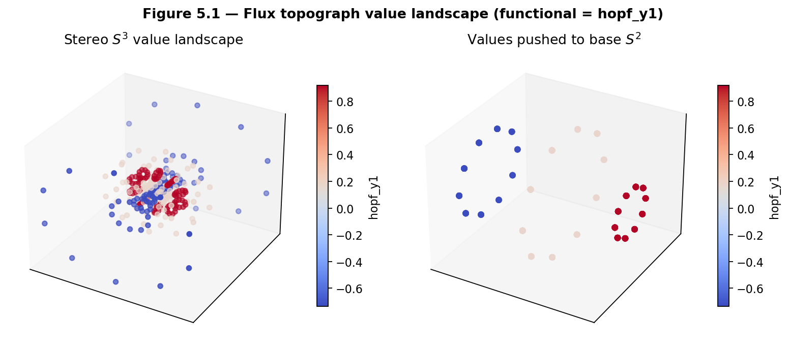
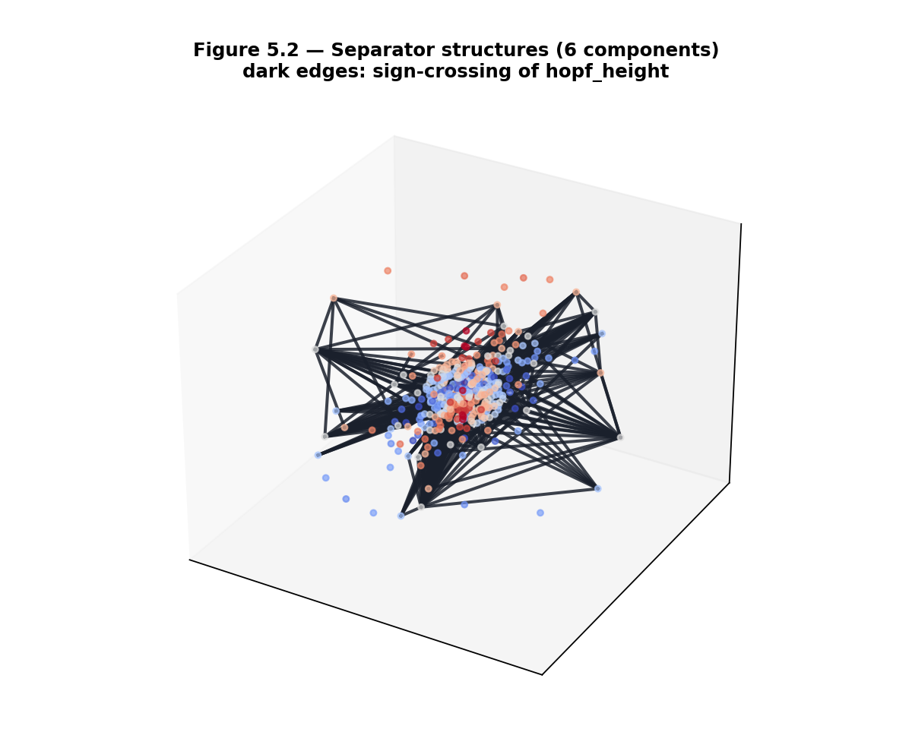
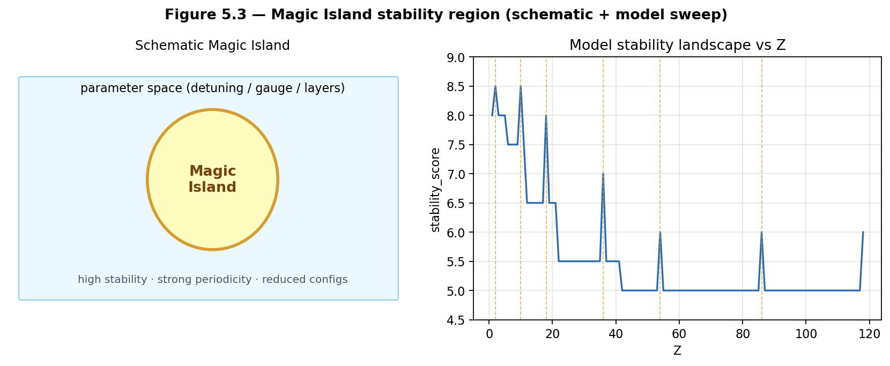
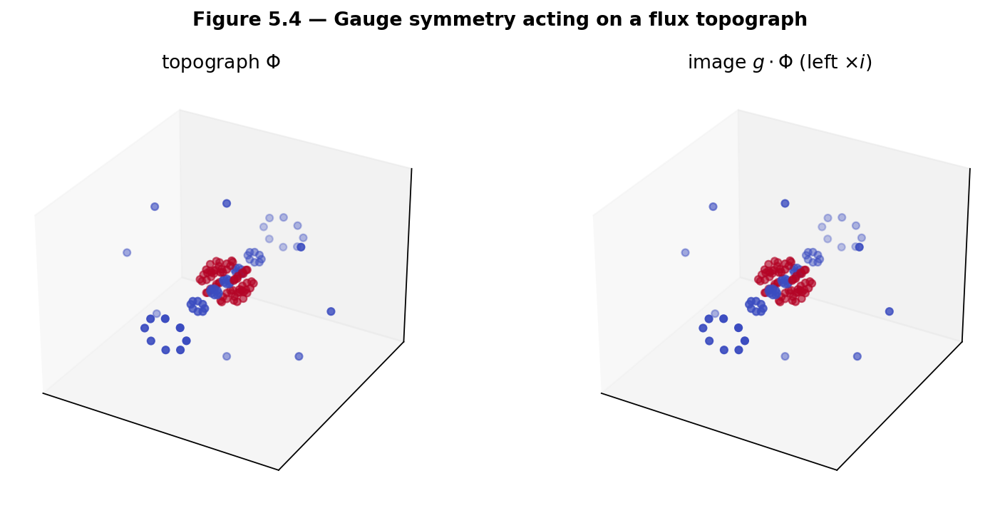
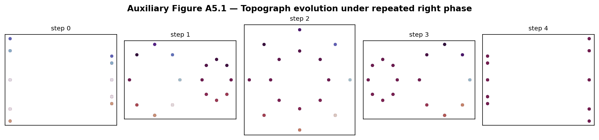

# Chapter 5 — Quaternionic Forms and Flux Topographs

This chapter lifts Conway’s topographs of binary quadratic forms (Hatcher Chapters 4–5) to the gauged Hopf lattice. We define **flux topographs**—value landscapes on the discrete lattice whose periodic separator structures encode stability, periodicity, and classification. The resulting theory is the direct higher-dimensional, quaternionic analogue of Hatcher’s visual number theory, with Magic Islands as a natural generalization of class-number phenomena and reduced forms—stated carefully as a **Model**.

**Learning goals**

1. Generalize binary quadratic forms and their topographs to flux functionals on the gauged Hopf lattice.  
2. Define flux topographs, value landscapes, and separator structures.  
3. Understand periodicity, reduced configurations, and Magic Islands.  
4. See how gauge symmetries act on topographs (equivariance).  
5. Prepare the visual and arithmetic foundation for classification (Chapter 6) and the \(Z\mapsto\) flywheel map (Chapter 7).

**Figures in this chapter**

| Tag | File | Role |
|-----|------|------|
| Fig. 5.1 | `figures/fig5_1_flux_topograph_schematic.png` | Flux topograph value landscape |
| Fig. 5.2 | `figures/fig5_2_separator_structure.png` | Periodic / sign-crossing separators |
| Fig. 5.3 | `figures/fig5_3_magic_island.png` | Magic Island schematic + model Z-sweep |
| Fig. 5.4 | `figures/fig5_4_symmetry_on_topograph.png` | Gauge action on a topograph |
| Aux A5.1 | `figures/aux5_1_topograph_evolution.png` | Evolution under repeated right phase |

**Claim discipline**

| Claim | Type |
|-------|------|
| Classical topograph properties (periodicity, arithmetic progression rule, reduced forms) from Hatcher | **Theorem** (classical; cited) |
| Flux topographs, separator structures, Magic Islands, gauge equivariance of candidate constructions | **Model** (core of OP2) |
| `qga/lib/flux_topograph.py`, `kingdom.core.flux_flywheel` APIs | Software facts |

---

## 5.1 From binary quadratic forms to flux functionals

In Hatcher, a binary quadratic form
\[
f(x,y) = ax^2 + bxy + cy^2
\]
acquires a **topograph**—a value landscape drawn on the dual of the Farey triangulation. Adjacent regions differ by an arithmetic progression rule, and periodic separator lines appear for indefinite forms (positive non-square discriminant).

We lift this picture to the gauged Hopf lattice of Chapters 3–4:

A **flux functional** on the lattice assigns a real (or integer) value to vertices—and, in richer versions, to edges or small cycles—such that the assignment transforms naturally under gauge actions. A **flux topograph** is the visual landscape of these values together with their level sets and separator structures.

Natural candidate functionals (all **Model** choices for OP2 experiments):

| Name (book helper) | Geometric meaning |
|--------------------|-------------------|
| `norm` | \(x^2+y^2+z^2\) on pure-imaginary part (quadratic form on \(\mathrm{Im}\,\mathbb{H}\)) |
| `hopf_y1` / `hopf_height` | Classical Hopf base coordinates (Ch. 2) |
| `phase` | Fiber phase proxy \(\mathrm{atan2}(x_4,x_3)\) |
| portal stability | `map_z_to_flywheel` scores (Ch. 7 preview) |

**Model note.** The precise choice of functional is part of the definition of flux topographs and is tied to **Open Problem 2**. No uniqueness claim is made in this chapter.

---

## 5.2 Flux topographs and separator structures

### Definition (working)

A **flux topograph** is a tuple
\[
\bigl(\Lambda,\; E,\; V,\; \mathcal{S}\bigr)
\]
where \(\Lambda\) is a discrete point set in \(S^3\), \(E\) is an edge set (along-fiber and/or inter-fiber from Ch. 3), \(V:\Lambda\to\mathbb{R}\) is a flux functional, and \(\mathcal{S}\) is the separator structure extracted from \(V\) (sign crossings, critical levels).

In code:
```text
FluxTopograph(points, values, edges, functional)
build_flux_topograph(points, edges=..., functional=...)
detect_separators(topo, threshold=..., mode='sign'|'level')
```



*Figure 5.1.* Value landscape for the functional `hopf_y1` on an angle-sampled lattice, shown in stereographic \(S^3\) and pushed to the base \(S^2\).

### Separator structures

**Separator structures** are the loci where the functional changes sign or crosses a critical threshold. On a graph, they appear as edges \((i,j)\) with \(V(i)\) and \(V(j)\) on opposite sides of a threshold. Connected components of those edges are discrete analogues of Hatcher’s separator curves.

In the indefinite / oscillatory case, separators can become **periodic** under the gauge group—exactly analogous to Hatcher’s periodic separator lines for indefinite binary forms, which encode infinitude (Pell-type families).



*Figure 5.2.* Dark edges: sign-crossing separators of `hopf_height` on the candidate adjacency graph. Component count and edge sets are experimental OP2 diagnostics, not theorems.

### Arithmetic progression rule (lift)

Classically, values on three regions meeting at a topograph edge satisfy a linear relation (Hatcher’s arithmetic progression rule). On the gauged Hopf lattice we only partially lift this: for each edge we can measure jumps \(V(j)-V(i)\) and study their regularity under gauge moves (`arithmetic_progression_residuals`). A full equivariant AP rule compatible with quaternion multiplication is part of **OP2**.

---

## 5.3 Periodicity, reduced configurations, and Magic Islands

### Periodicity under the gauge group

When a flux topograph is (approximately) periodic under a composite gauge sequence \(g\) from Chapter 4—i.e. \(g^k\cdot\Phi \approx \Phi\) for some \(k\)—the orbit corresponds to a **reduced configuration**. The book helper `periodicity_score` reports nearest-neighbor total-space return and multiset distance of values.

### Magic Islands

**Magic Islands** are pockets of enhanced stability in parameter space (detuning \(\delta\omega\), gauge strength, layers, or atomic number \(Z\) in the portal Model). Inside an island the topograph (or the derived stability score) shows strong order: high `stability_score`, noble-gas locks, low variation. Outside, scores drop and dynamical simulations become more chaotic (Ch. 3 Aux A3.1).

They are the narrative generalization of finite class number and reduced forms in Hatcher’s theory. **Arithmetic characterization** (class-number-like invariants predicting islands) is deferred to Open Problem 3 / Chapter 6.



*Figure 5.3.* Left: schematic island in parameter space. Right: Kingdom Come Model `stability_score` vs \(Z\) (gold lines mark noble-gas \(Z\)). Software fact for the right panel; physical interpretation remains **Model**.

**Claim type.** Visual and software properties of Magic Islands in the portal: **Model** + software facts. Classical reduced forms / class number: **Theorem** (Hatcher). Correspondence between the two: **Open** (OP3).

---

## 5.4 Gauge equivariance of flux topographs

Any well-defined flux topograph must be **equivariant** under the gauge group of Chapter 4: applying a left or right multiplication must map the topograph to another topograph of the same type (possibly after transporting values or recomputing a geometric functional).

This is the direct analogue of Hatcher’s requirement that topographs transform properly under linear fractional transformations.



*Figure 5.4.* Left multiplication by \(i\) maps a `hopf_y1` topograph to its image. For geometric functionals recomputed after the move, values track the geometry exactly.



*Auxiliary Figure A5.1.* Repeated right phase advances: base scatter colored by `phase` functional. Separator patterns should transform predictably if OP2 axioms hold.

**Open Problem 2 (core of this chapter).**  
Formalize the axioms of a flux topograph so that:

1. The structure **reduces** to Conway/Hatcher topographs under a suitable projection or restriction.  
2. Separator periodicity and an arithmetic progression rule lift naturally.  
3. **Gauge equivariance** holds for a fixed adjacency rule from Chapter 3 (OP1).  
4. Magic Islands emerge as finite or periodic reduced regions with measurable stability.

**Sandbox:** `qga/lib/flux_topograph.py` — `build_flux_topograph`, `detect_separators`, `periodicity_score`, `separator_equivariance_score`.

---

## 5.5 First computational labs

```text
qga/lib/flux_topograph.py
qga/lib/hopf_lattice.py
kingdom.core.flux_flywheel   # map_z_to_flywheel, map_z_to_flywheel_extended
kingdom.viz.magic_island     # heatmap (portal)
```

### Lab 5.A — Build a simple flux topograph

```python
import sys
from pathlib import Path
sys.path.insert(0, str(Path.home() / "Projects" / "qga"))

from lib.hopf_lattice import sample_angle_lattice, candidate_adjacency
from lib.flux_topograph import build_flux_topograph, detect_separators, arithmetic_progression_residuals

pts = sample_angle_lattice(n_eta=4, n_xi1=12, n_xi2=12)
along, inter = candidate_adjacency(pts, base_angle_thresh=0.5, fiber_phase_bins=12)
topo = build_flux_topograph(pts, edges=along + inter, functional="hopf_height")
seps = detect_separators(topo, mode="sign")
print("separator components:", len(seps))
print("separator edges:", sum(len(c) for c in seps))
print("jump stats:", arithmetic_progression_residuals(topo))
```

### Lab 5.B — Periodicity under a gauge sequence

```python
from lib.flux_topograph import periodicity_score
from lib.hopf_lattice import phase_unit
import numpy as np

i = np.array([0.0, 1.0, 0.0, 0.0])
seq = [("L", i), ("R", phase_unit(np.pi / 2))]
score = periodicity_score(topo, seq, max_periods=8)
print(score)
# period_found > 0 means approximate return within tol
```

### Lab 5.C — Magic Island / Z-stability (portal Model)

There is **no** `magic_flag` key in the current API. Use `stability_score`, `stability_class`, and `is_noble_gas`:

```python
# PYTHONPATH must include kingdom/src and flux_hopf_lib/src
from kingdom.core.flux_flywheel import map_z_to_flywheel, map_z_to_flywheel_extended

for z in [2, 10, 26, 79, 118]:
    m = map_z_to_flywheel(z)
    print(
        z,
        "score=", m["stability_score"],
        "class=", m["stability_class"],
        "noble=", m.get("is_noble_gas"),
    )
    # extended adds chemistry-facing validation fields
    ext = map_z_to_flywheel_extended(z)
    print("   alignment_stability_pts=", ext.get("alignment_stability_pts"))
```

High scores near noble gases (e.g. \(Z=2,10\)) illustrate Magic Island–adjacent locks in the working Model.

### Lab 5.D — Gauge action on separators (OP2 diagnostic)

```python
from lib.flux_topograph import separator_equivariance_score

print(separator_equivariance_score(topo, [("L", i)]))
# edge_count_ratio ~ 1 suggests separator mass is roughly preserved
```

---

## Exercises

**5.A (hand).** State the classical arithmetic progression rule for Hatcher topographs (or look it up in TN Ch. 4) and propose a quaternionic lift for flux values on adjacent lattice elements.

**5.B (hand).** In two sentences, explain why gauge equivariance is a necessary condition for a flux topograph to be well-defined.

**5.C (code).** Complete Labs 5.A–5.B. Report separator component count and `periodicity_score` for your functional.

**5.D (code).** Run Lab 5.C for \(Z\in\{2,10,26,79,118\}\). Which values show high `stability_score` or `is_noble_gas=True`? Record the pattern.

**5.E (visual).** Generate a flux topograph and apply one gauge transformation (Fig. 5.4). Describe how separator curves / value colors transform.

**5.F (Hatcher bridge).** In Hatcher, reduced forms and class number classify quadratic forms up to equivalence. Sketch how Magic Islands might play an analogous role for flux configurations on the gauged Hopf lattice.

**5.G (Open Problem 2 teaser).** Using `build_flux_topograph` and `detect_separators`, test whether separator counts survive under `candidate_adjacency` + left/right multiplications (`separator_equivariance_score`). Document failures—they inform OP2 axioms.

**5.H (forward).** Why will the classification theory of Chapter 6 depend on the periodic separator structures developed here?

**5.I (software honesty).** In one paragraph, distinguish: (i) pedagogical flux functionals in `qga/lib/flux_topograph.py`, (ii) portal `stability_score` from `map_z_to_flywheel`, (iii) classical Conway topographs. Assign claim types.

---

## Code and asset pointers

```text
qga/lib/flux_topograph.py
  build_flux_topograph, detect_separators, periodicity_score,
  apply_gauge_to_topograph, separator_equivariance_score,
  arithmetic_progression_residuals, stability_landscape_z

qga/lib/hopf_lattice.py
kingdom.core.flux_flywheel.map_z_to_flywheel[_extended]
kingdom.viz.magic_island.build_magic_island_heatmap
```

**Figures:** `scripts/generate_ch5_figures.py`  
**Related portal:** Flux Flywheel tab; Magic Island heatmap; Lattice Simulator (dynamical backdrop).  
**Open problems:** OP2 (`notes/open_problems.md`); depends on OP1 adjacency.

---

## Looking ahead

Flux topographs are the visual and arithmetic heart of Part III—the direct quaternionic lift of Hatcher’s topographs, still with **Model**-level axioms pending OP2. In **Chapter 6** we classify these topographs, enumerate reduced configurations, and formalize Magic Islands as higher-dimensional analogues of class numbers and reduced forms. **Chapter 7** connects classified objects to the \(Z\mapsto\) flywheel map, completing the representation-theoretic bridge from number theory to the periodic-table proxy in the Kingdom Come Model.

With flux topographs in hand, we are ready for the classification theory that turns visual landscapes into arithmetic invariants.

---

*Part III, Chapter 5 draft. Figures in `book/figures/`. Core of Open Problem 2 stated. Helper: `qga/lib/flux_topograph.py`.*
