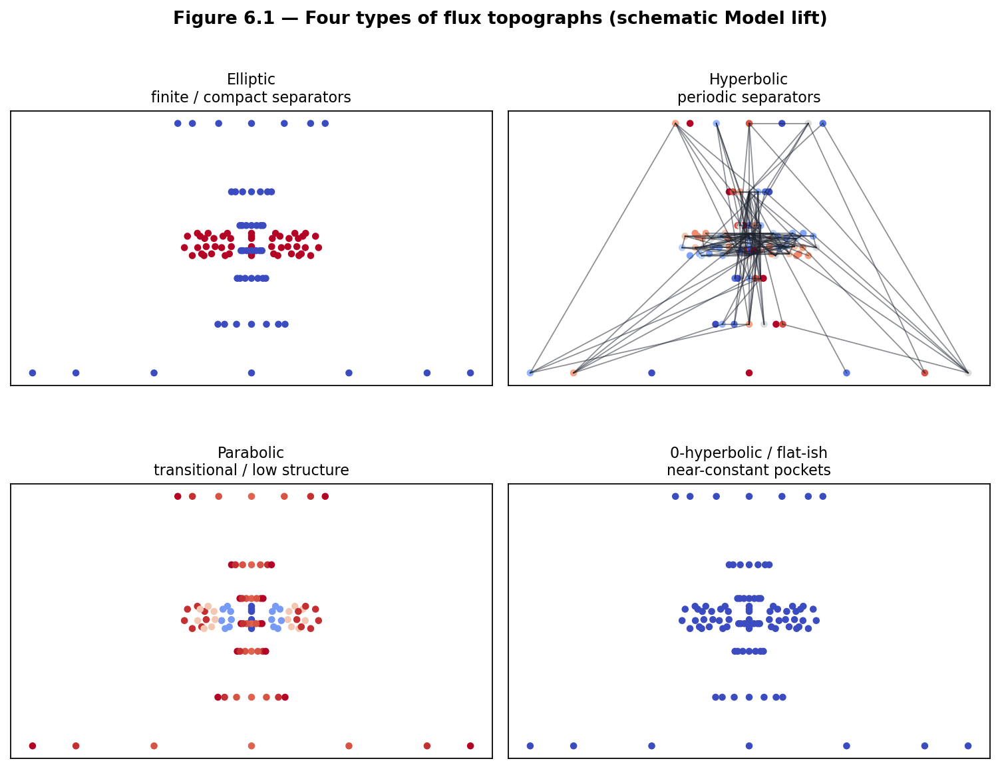
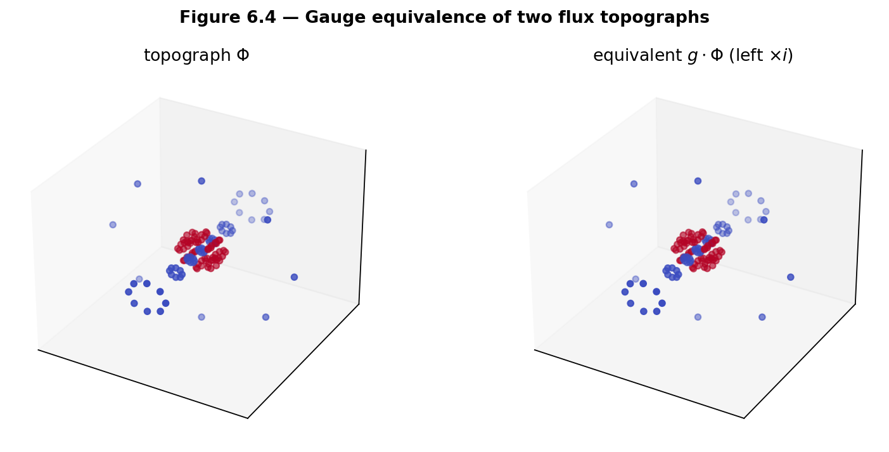
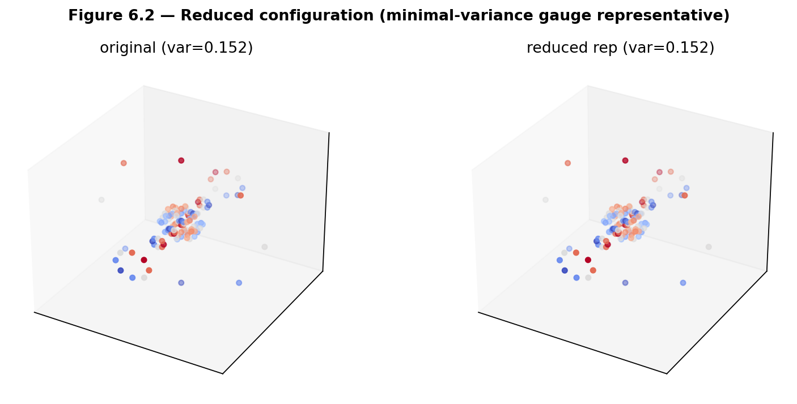
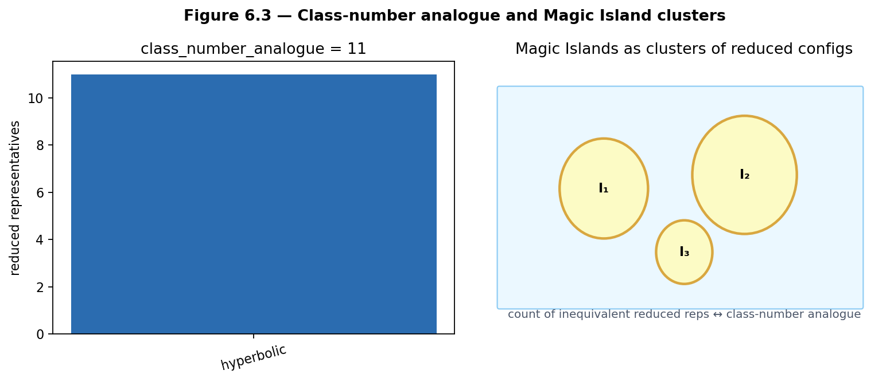
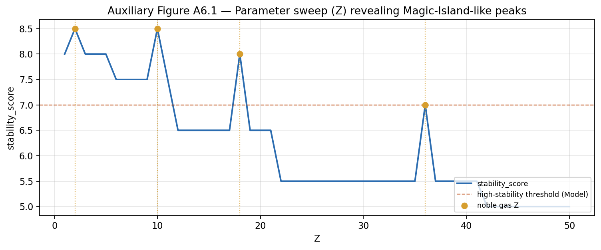

# Chapter 6 — Classification of Flux Topographs and Magic Islands

This chapter classifies flux topographs on the gauged Hopf lattice, enumerates reduced configurations, and formalizes **Magic Islands** as higher-dimensional analogues of class numbers and reduced forms. The theory mirrors Hatcher Chapters 5–6 while remaining a **Model** construction pending the axioms of Open Problems 2–3.

**Learning goals**

1. Classify flux topographs by invariants analogous to discriminant and type (elliptic / hyperbolic / …).  
2. Define equivalence of topographs under gauge actions.  
3. Enumerate reduced configurations and compute class-number-like invariants.  
4. Formalize Magic Islands as pockets of enhanced periodicity and stability.  
5. Prepare the arithmetic foundation for the \(Z\mapsto\) flywheel map (Chapter 7) and the class-group lift (Chapter 8).

**Figures in this chapter**

| Tag | File | Role |
|-----|------|------|
| Fig. 6.1 | `figures/fig6_1_four_types.png` | Four types of flux topographs (schematic) |
| Fig. 6.2 | `figures/fig6_2_reduced_config.png` | Reduced configuration (minimal-variance rep) |
| Fig. 6.3 | `figures/fig6_3_class_number_analogue.png` | Class-number-like count of reduced islands |
| Fig. 6.4 | `figures/fig6_4_equivalence.png` | Gauge equivalence of two topographs |
| Aux A6.1 | `figures/aux6_1_island_sweep.png` | Z-sweep revealing Magic-Island-like peaks |

**Claim discipline**

| Claim | Type |
|-------|------|
| Classical classification of quadratic forms and topographs (Hatcher Ch. 5) | **Theorem** (cited) |
| Flux topograph types, equivalence, reduced configurations, Magic Islands | **Model** (core of OP3; depends on OP2) |
| `qga/lib/flux_topograph.py` classification helpers; Kingdom Come `stability_score` | **Software fact** |

---

## 6.1 The four types of flux topographs

In Hatcher, binary quadratic forms (and their topographs) are classified by the sign of the discriminant \(\Delta = b^2-4ac\):

| Discriminant | Classical type | Topograph character |
|--------------|----------------|---------------------|
| \(\Delta>0\) nonsquare | hyperbolic | periodic separators |
| \(\Delta>0\) square | 0-hyperbolic / parabolic edge | degenerate |
| \(\Delta<0\) | elliptic | finite reduced forms |
| \(\Delta=0\) | parabolic | boundary / degenerate |

We lift this classification to flux topographs by examining the flux functional \(V\) and its separator structures under the gauge group of Chapter 4—**not** by computing a classical \(\Delta\) (that remains OP2–3 territory).

| Type | Separator behavior | Reduced configurations | Magic Island character |
|------|--------------------|------------------------|------------------------|
| Hyperbolic | Periodic separators under gauge | Infinite / periodic families | Large stable islands |
| Elliptic | Finite / bounded separators | Finite reduced set | Compact high-stability pockets |
| Parabolic | Degenerate / transitional separators | Marginal cases | Boundary regions |
| 0-hyperbolic | Flat or near-constant regions | Trivial / degenerate | Noble-gas-like locks |



*Figure 6.1.* Schematic value landscapes and separator patterns for the four lifted types. Generated with pedagogical functionals; labels are Model categories.

### Heuristic classifier (software / Model)

```text
classify_topograph_type(topo) →
  type, reason, n_separator_edges, value_variance,
  best_period_found, signature, ...
```

The decision tree (explicitly heuristic) uses:

1. near-constant values → `0-hyperbolic`  
2. no sign separators + low variance → `parabolic`  
3. periodic under a small gauge dictionary + separators → `hyperbolic`  
4. few separator components → `elliptic`  
5. otherwise transitional `parabolic`

This is **not** a theorem of classification—only a lab tool for OP3 experiments.

---

## 6.2 Equivalence of flux topographs

Two flux topographs are **equivalent** (in the working Model) if there exists a gauge transformation—or finite sequence of gauge actions—that maps one to the other, with values recomputed from a geometric functional or transported by index.

This is the direct analogue of Hatcher’s equivalence of quadratic forms under \(\mathrm{SL}(2,\mathbb{Z})\) / linear fractional transformations.



*Figure 6.4.* A topograph and its image under left multiplication by \(i\). Value multisets and sorted point clouds match for geometric functionals (`equivalence_distance` near zero).

### Distance and reduced representatives

```text
equivalence_distance(topo_a, topo_b)
reduced_representative(topo)           # minimize value variance in a gauge orbit
enumerate_reduced(topo, dedup_tol=...)  # inequivalent reduced orbit reps
```

**Reduced configurations** are representatives chosen from each approximate equivalence class by a normalization rule (here: minimal value variance among a bounded gauge orbit). The number of distinct reduced configurations is a **class-number analogue**.



*Figure 6.2.* Original topograph vs reduced representative selected by minimal variance under the standard gauge dictionary.

---

## 6.3 Magic Islands as higher-dimensional class-number phenomena

**Magic Islands** are regions in parameter space (or in the space of flux functionals) that contain a high density of reduced configurations with strong periodicity and high stability scores.

They generalize:

- the finite set of reduced forms for negative discriminant (elliptic case);  
- the periodic reduced cycles for positive nonsquare discriminant (hyperbolic case).

In the Kingdom Come Model, Magic Islands appear as pockets where `stability_score` is high, `stability_class` is noble-like, and dynamical simulations show ordered long-term behavior (Ch. 3–5).

**Invariant discipline (forward pointer).** When classifying topograph types and Magic Islands, keep separate: (i) *algebraic* structure of discrete labels or class-like counts, (ii) *sequential / Model flow* of scores along parameter or \(Z\) sweeps, and (iii) *statistical geometric lock* of a pattern to a continuous base beyond chance. The distinction among these three layers—developed with controls in **Chapter 9 section 9.5**—applies directly here: high `stability_score` clusters and visual island order are not automatically the same as an algebraic class number, nor as a proved lock to a continuous geometric coordinate. See also Chapter 10’s checklist and `notes/RESEARCH_NOTE_moduli.md`.



*Figure 6.3.* Left: count of inequivalent reduced representatives by type (`class_number_analogue`). Right: schematic islands as clusters of reduced configs.



*Auxiliary Figure A6.1.* Portal Model `stability_score` vs \(Z\) (gold: noble-gas \(Z\); dashed: high-stability threshold). **Software fact** for the curve; island interpretation remains **Model**.

### Heuristic island score

```text
magic_island_score(topo) → score, period_term, variance_term, separator_term, type
class_number_analogue(topo) → class_number_analogue, by_type, reduced
```

Higher `magic_island_score` means more “island-like” under the pedagogical formula (periodicity + controlled variance + ordered separators). It is **not** a classical invariant.

**Open Problem 3 (core of this chapter).**  
Develop invariants (discriminant analogues, class-number-like counts) that predict the location and size of Magic Islands from lattice data and flux functionals **without** exhaustive parameter sweeps—and that reduce to classical class numbers under a Hatcher-style restriction.

See `notes/open_problems.md`. Depends on OP1 (adjacency) and OP2 (topograph axioms).

---

## 6.4 First computational labs

Helpers: `lib/flux_topograph.py` · **Appendix C §C.3**.

- **6.A** `classify_topograph_type`.
- **6.B** `enumerate_reduced` / `class_number_analogue` (use modest lattices).
- **6.C** Portal `stability_score` vs \(Z\) (no `magic_flag`).
- **6.D** `equivalence_distance` after left multiplication.

```python
from lib.flux_topograph import classify_topograph_type, class_number_analogue
# build topo as in Appendix C §C.3
# print(classify_topograph_type(topo)["type"])
```


---

## Exercises

**6.A (hand).** State the four classical types of quadratic forms/topographs in Hatcher and map each to the lifted types in this chapter.

**6.B (hand).** Explain why reduced configurations are useful for classification (one paragraph).

**6.C (code).** Complete Labs 6.A–6.B. Report the type and number of reduced representatives for your topograph.

**6.D (code).** Run Lab 6.C for \(Z=1\) to \(50\). Tabulate `stability_score` and mark noble-gas \(Z\). Identify any visible Magic-Island-like clusters.

**6.E (visual).** Generate two equivalent topographs (via gauge action) and confirm `equivalence_distance` is small; compare separator counts.

**6.F (Hatcher bridge).** In Hatcher, the class number counts inequivalent reduced forms for a given discriminant. Sketch how a “Magic Island count” / `class_number_analogue` could play an analogous role here.

**6.G (Open Problem 3 teaser).** Using `enumerate_reduced` and `magic_island_score`, test whether the current candidate adjacency produces consistent island scores across small changes in functional (`hopf_height` vs `hopf_y1`). Document inconsistencies—they constrain OP3 invariants.

**6.H (forward).** Why will the ideal-class-group lift in Chapter 8 depend on the classification developed here?

**6.I (software honesty).** In one paragraph, distinguish: (i) heuristic `classify_topograph_type`, (ii) portal `stability_score` vs \(Z\), (iii) classical class numbers. Assign claim types.

---

## Code and asset pointers

```text
qga/lib/flux_topograph.py   # Ch. 5–6 helpers
qga/lib/hopf_lattice.py
kingdom.core.flux_flywheel
kingdom.viz.magic_island
```

**Figures:** `scripts/generate_ch6_figures.py`  
**Related portal:** Flux Flywheel tab; Magic Island heatmap.  
**Open problems:** OP3 (this chapter); OP2 (topograph axioms); OP1 (adjacency).

---

## Looking ahead

We now have a working **Model** classification of flux topographs, reduced configurations, and Magic Islands—the quaternionic narrative lift of Hatcher’s classification theory. In **Chapter 7** we connect these classified objects to the \(Z\mapsto\) flywheel map, turning arithmetic-looking invariants into a periodic-table proxy. **Chapter 8** will then lift the class group itself to the quaternionic / Hopf setting. **Chapter 9 section 9.5** will sharpen the arithmetic–geometry boundary with a controlled three-layer analysis (algebra / sequential flow / angle lock) that you can already apply when reading island plots in this chapter.

With classification in hand, we are ready to bridge number theory and the emergent physics of the Kingdom Come Model.

---

*Manuscript · Part III · Chapter 6 · Figures in `book/figures/` · Helpers: `lib/flux_topograph.py` · OP3.*
