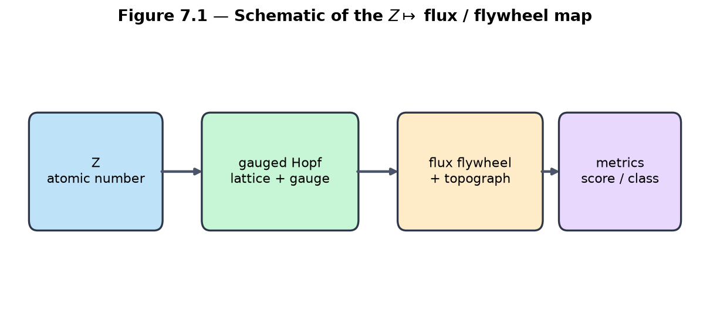
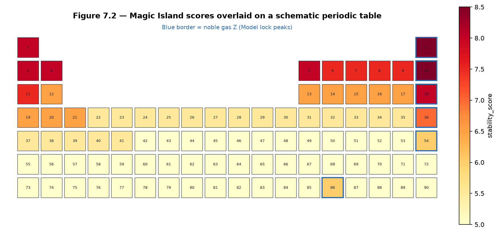
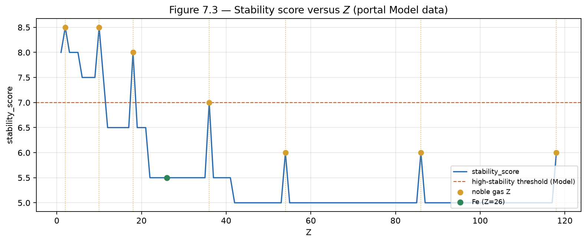
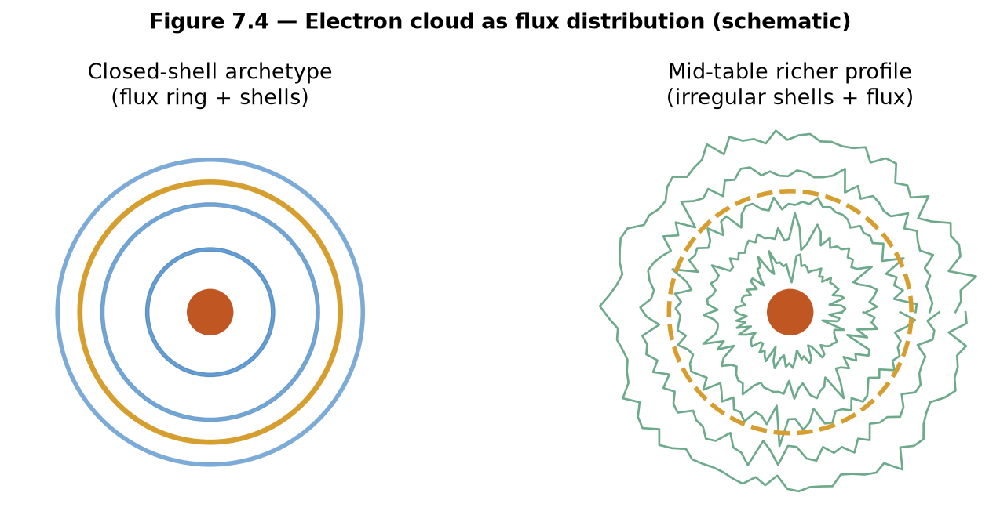
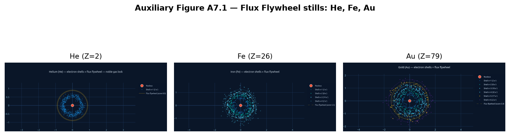

# Chapter 7 — The \(Z \mapsto\) Flux Map and Representation Theory

This chapter connects the classified flux topographs and Magic Islands of Chapters 5–6 to the atomic number \(Z\). We define the **\(Z \mapsto\) flux map**, interpret it as a representation-theoretic bridge (which “numbers” are represented by stable flux configurations), and examine how Magic Islands align with chemically and physically special elements. The construction remains a **Model** with explicit validation pathways (Chapter 10).

**Learning goals**

1. Define the \(Z \mapsto\) flywheel / flux configuration map formally.  
2. Interpret the map as representation theory on the gauged Hopf lattice.  
3. Connect Magic Islands to the periodic table and noble-gas stability.  
4. Examine chemical and physical proxies (stability scores, shell descriptors, extended fields).  
5. Prepare the bridge to class-group ideas (Chapter 8) and observational validation (Chapter 10).

**Figures in this chapter**

| Tag | File | Role |
|-----|------|------|
| Fig. 7.1 | `figures/fig7_1_z_to_flywheel.png` | Schematic of the \(Z \mapsto\) flux map |
| Fig. 7.2 | `figures/fig7_2_magic_island_periodic_table.png` | Magic Island scores on a schematic table |
| Fig. 7.3 | `figures/fig7_3_stability_vs_z.png` | `stability_score` vs \(Z\) (portal data) |
| Fig. 7.4 | `figures/fig7_4_electron_cloud_flux.png` | Electron cloud as flux distribution |
| Aux A7.1 | `figures/aux7_1_he_fe_au_stills.png` | He, Fe, Au flywheel stills |

**Claim discipline**

| Claim | Type |
|-------|------|
| Four-square theorem and classical representation by norms (Ch. 1) | **Theorem** |
| Existence and implementation of the coded \(Z \mapsto\) map | **Software fact** |
| Map as representation theory; Magic Islands as periodic-table proxy; physical emergence | **Model** |
| Any claim that topology *derives* real chemistry as a law of nature | **Hypothesis** (Ch. 10 validation) |
| `map_z_to_flywheel[_extended]` metrics | **Software fact** |

---

## 7.1 The \(Z \mapsto\) flux map

The Kingdom Come portal implements a function that takes an atomic number \(Z\) and returns a flywheel configuration together with stability and chemistry-facing metrics:
\[
Z \;\longmapsto\;
\bigl(
  \text{flywheel / detuning state},\;
  \texttt{stability\_score},\;
  \texttt{stability\_class},\;
  \texttt{is\_noble\_gas},\;
  \text{shell / representation descriptors},\;
  \ldots
\bigr).
\]

**Primary entry points**

| Function | Role |
|----------|------|
| `map_z_to_flywheel(z)` | Core map: detuning, gauge params, `stability_score`, class labels |
| `map_z_to_flywheel_extended(z)` | Adds alignment, IE proxies, magnetic-moment validation fields |

There is still **no** `magic_flag` key. Treat high `stability_score`, noble-gas class strings, and `is_noble_gas=True` as the Model’s island indicators.

The map is built on the gauged Hopf lattice and flux-topograph language of previous chapters. Different detuning parameters select different stability islands; a documented ultra-stable lock (Magic Island Sweep reference in portal notes) serves as a noble-gas-like template.



*Figure 7.1.* Pipeline: atomic number → lattice / gauge data → flux flywheel + topograph → scored metrics.

**Claim type.** Reproducible coded map: **Software fact**. Interpreting outputs as *the* emergence mechanism of the periodic table: **Model**.

### Book helper

```text
stability_landscape_z(z_values=...)          # list of dict rows
stability_landscape_z(z_range=(1, 50))       # inclusive range
stability_landscape_z(z_range=(1, 30), extended=True)
```

---

## 7.2 Representation theory on the gauged Hopf lattice

In classical number theory, representation by quadratic forms asks which integers \(n\) satisfy \(f(x,y)=n\) for a given form (Hatcher Chapter 6). Quaternion norms answer which \(n\) are sums of four squares (Chapter 1, **Theorem**).

Here we ask an analogous **Model** question:

> Which atomic numbers \(Z\) are “represented” by stable flux configurations on the gauged Hopf lattice?

Stable flywheels correspond to reduced configurations with high `magic_island_score` (Chapter 6) and high portal `stability_score`. The map therefore selects, for each \(Z\), a configuration (or orbit) intended to match observed chemical/nuclear specialness.

| Classical | Quaternionic / Hopf Model |
|-----------|---------------------------|
| Form \(f\) | Lattice + gauge group + flux functional |
| Represented integer \(n\) | Atomic number \(Z\) (and related quantum numbers) |
| Class / genus of forms | Equivalence class of topographs / flywheels |
| Class number | `class_number_analogue` / island counts (Ch. 6) |

This is a **representation-theoretic reading**, not a theorem that every chemical property is a lattice invariant.



*Figure 7.2.* Cells colored by portal `stability_score`; blue borders mark noble-gas \(Z\). Layout is a simplified table for visualization (f-block truncated)—software + Model.

---

## 7.3 Magic Islands and real chemical stability

In the working Model, Magic Islands correlate with:

- noble-gas electronic configurations (closed shells);  
- high portal stability scores near selected \(Z\);  
- (in extended fields) partial alignment with experimental ionization energies and magnetic proxies.

High `stability_score` near \(Z=2,10,18,\ldots\) illustrates island structure in the current implementation. Mid-table elements (e.g. Fe, \(Z=26\)) may score lower even when chemically important—reminding us that the Model is a **proxy**, not a complete chemistry engine.



*Figure 7.3.* Portal data: `stability_score` vs atomic number. Gold: noble-gas \(Z\); green: Fe; dashed: high-stability threshold used in labs.

**Claim type.** Curve and peaks as outputs of `map_z_to_flywheel`: **Software fact**. Physical explanation of real chemistry/nuclear magic numbers: **Model** / **Hypothesis** pending Chapter 10 protocols.

**Open Problem 4 (shared with Ch. 10).**  
Up to gauge, is the map \(Z\mapsto\) flywheel configuration unique under stated axioms? If not, classify the ambiguity and its chemical consequences. See `notes/open_problems.md`.

---

## 7.4 Electron clouds as flux distributions

The portal renders each \(Z\) with shell-like clouds whose geometry is tied to the underlying flux flywheel (stylized 2D density + flux ring; see `kingdom.viz.electron_cloud`). These are visual counterparts of classical electron-cloud pictures, generated from Model flux rather than from solving the Schrödinger equation.



*Figure 7.4.* Schematic closed-shell vs mid-table flux-derived profiles.



*Auxiliary Figure A7.1.* Portal Flux Flywheel stills: He (\(Z=2\), closed-shell archetype), Fe (\(Z=26\), mid-table), Au (\(Z=79\), heavy comparison). Sources: `kingdom/z_knowns/frame_0002.png`, `frame_0026.png`, `frame_0079.png`.

---

## 7.5 First computational labs

Portal: `map_z_to_flywheel[_extended]` · `stability_landscape_z` · **Appendix C §C.3**.

- **7.A** Scores for \(Z\in\{2,10,26,79,118\}\).
- **7.B** `stability_landscape_z(z_range=(1,50))` high islands.
- **7.C** Noble vs neighbors (\(Z=10,11,12\)).
- **7.D** Gradio Flux Flywheel / Aux A7.1.
- **7.E** Extended fields He vs Fe.

```python
from kingdom.core.flux_flywheel import map_z_to_flywheel
print(map_z_to_flywheel(2)["stability_score"], map_z_to_flywheel(2).get("is_noble_gas"))
```


---

## Exercises

**7.A (hand).** In one paragraph, explain why the \(Z\mapsto\) map can be viewed as a representation problem on the gauged Hopf lattice.

**7.B (hand).** Why might Magic Islands near noble-gas \(Z\) be especially stable in the Model? Connect to closed-shell ideas and Chapter 6 reduced configurations.

**7.C (code).** Complete Labs 7.A–7.B. Tabulate `stability_score` and `is_noble_gas` for \(Z=1\) to \(30\). Identify the strongest islands.

**7.D (code).** Complete Lab 7.E for \(Z=2\) and \(Z=26\). What differences appear in extended fields?

**7.E (visual).** Render or inspect flux-derived clouds for He and Fe. Describe how Model geometry differs between a closed-shell case and a mid-table case.

**7.F (Hatcher bridge).** In Hatcher Chapter 6, representation by quadratic forms uses genus, characters, and quadratic reciprocity. Sketch how the \(Z\mapsto\) map might eventually use “genus” of flux configurations or topological characters on the lattice.

**7.G (forward).** Why will class-group ideas (Chapter 8) be relevant to which \(Z\) land in Magic Islands?

**7.H (software honesty).** Distinguish in one paragraph: (i) the coded \(Z\mapsto\) map as software, (ii) its use as a periodic-table proxy (**Model**), (iii) any claim that it derives real chemistry from topology (**Hypothesis**).

**7.I (Open Problem 4 teaser).** Fix a small set of gauge sequences from Chapter 4. For two nearby \(Z\), inspect whether flywheel metrics could plausibly share an orbit. What would count as non-uniqueness of the map?

---

## Code and asset pointers

```text
kingdom.core.flux_flywheel.map_z_to_flywheel[_extended]
qga/lib/flux_topograph.stability_landscape_z
kingdom.viz.magic_island.build_magic_island_heatmap
kingdom.viz.electron_cloud.build_electron_cloud_figure
kingdom/z_knowns/frame_XXXX.png   # flywheel stills
```

**Figures:** `scripts/generate_ch7_figures.py`  
**Related portal:** Flux Flywheel tab (interactive \(Z\) slider).  
**Open problems:** OP4 (uniqueness); OP3 (island invariants); OP5 (\(350/\pi\), Ch. 10).

---

## Looking ahead

The \(Z\mapsto\) flux map links the classified arithmetic objects of Chapters 5–6 to concrete atomic numbers. In **Chapter 8** we lift the class group itself to the quaternionic / Hopf setting, giving a deeper arithmetic home for Magic Island counts and equivalence classes. **Chapter 10** returns to observational validation of the whole construction—including statistical protocols for the \(350/\pi\) signature and \(Z\)-map correlations.

With the representation bridge in place, we are ready for the ideal-class-group lift.

---

*Manuscript · Part III · Chapter 7 · Figures in `book/figures/` · Portal: `map_z_to_flywheel` · OP4.*
