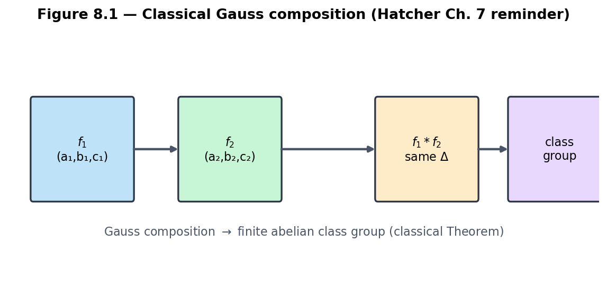
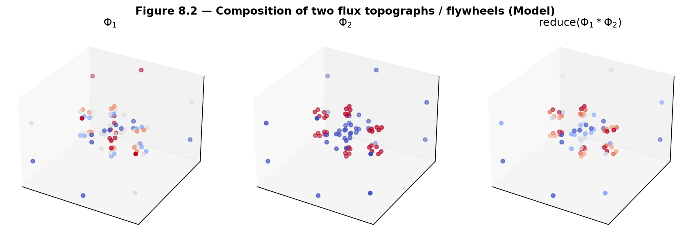
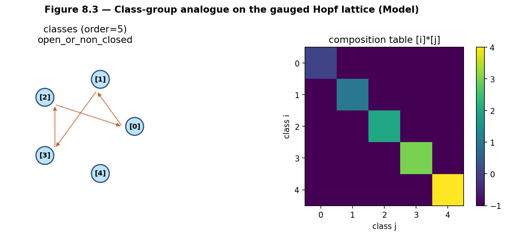
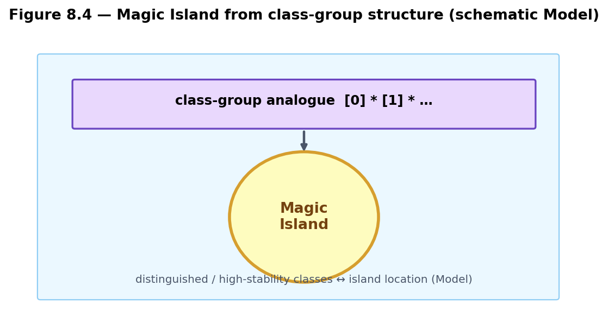
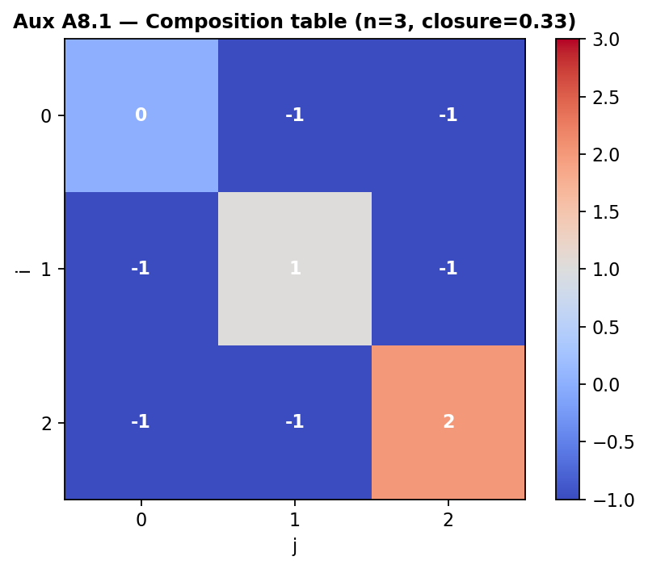

# Chapter 8 — Composition and Class Groups in the Quaternionic Setting

This chapter lifts Gauss composition of binary quadratic forms and the ideal class group (Hatcher Chapters 7–8) to the gauged Hopf lattice and quaternion orders. We define composition of flux configurations / flywheels, construct class-group analogues, and examine how these structures organize Magic Islands and equivalence classes. The theory remains a **Model** construction, with **Open Problem 6** as its central open edge.

**Learning goals**

1. Recall Gauss composition of quadratic forms and its arithmetic meaning.  
2. Lift composition to flux configurations and flywheels on the gauged Hopf lattice.  
3. Construct class-group analogues for flux topographs (and, later, quaternion orders).  
4. Connect class-group structure to Magic Island counts and equivalence classes.  
5. Prepare the ground for quaternion algebras and ideal theory (Chapter 9).

**Figures in this chapter**

| Tag | File | Role |
|-----|------|------|
| Fig. 8.1 | `figures/fig8_1_gauss_composition.png` | Classical Gauss composition diagram |
| Fig. 8.2 | `figures/fig8_2_flywheel_composition.png` | Composition of two flux topographs |
| Fig. 8.3 | `figures/fig8_3_class_group_analogue.png` | Class-group analogue on the lattice |
| Fig. 8.4 | `figures/fig8_4_island_from_class.png` | Magic Island from class-group data |
| Aux A8.1 | `figures/aux8_1_composition_table.png` | Small composition table |

**Claim discipline**

| Claim | Type |
|-------|------|
| Classical Gauss composition and ideal class groups (Hatcher Ch. 7–8) | **Theorem** (cited) |
| Composition of flux configurations / flywheels; class-group analogues | **Model** (core of OP6) |
| `qga/lib/composition.py` helpers | Software facts |

---

## 8.1 Gauss composition — classical reminder

In Hatcher Chapter 7, Gauss defined a composition law on (primitive) binary quadratic forms of the same discriminant. Up to equivalence, the law is associative and turns the set of classes into a finite abelian group—the **class group** of the discriminant. The same group appears as the ideal class group of the corresponding quadratic order (Hatcher Chapter 8).



*Figure 8.1.* Forms \(f_1,f_2\) of fixed discriminant compose to a third form; classes form a finite abelian group. This is classical **Theorem** territory; we cite Hatcher / Gauss rather than re-prove.

Why it matters here: class groups encode failure of unique factorization and control representation theory—exactly the arithmetic depth we want to lift for Magic Islands and the \(Z\mapsto\) map.

---

## 8.2 Lifting composition to flux configurations and flywheels

On the gauged Hopf lattice we define a **composition** of two flux topographs (or flywheels) by combining values and/or points, then reducing with the Chapter 6 normalization.

### Candidate methods (**Model**)

| Method (code) | Rule |
|---------------|------|
| `value_sum` | Pointwise average of values; averaged then renormed points |
| `value_product` | Pointwise product (scaled) |
| `value_bilinear` | Soft bilinear blend \((V_a+V_b+V_a V_b)/3\) |
| `point_mult` | Quaternion multiply corresponding lattice points; recompute functional |

```text
compose_flywheels(topo_a, topo_b, method="value_sum")
reduce_composition(composed) → topograph, classification, magic_island_score
```



*Figure 8.2.* \(\Phi_1\), \(\Phi_2\), and \(\mathrm{reduce}(\Phi_1*\Phi_2)\) for the pedagogical `value_sum` method.

**Honest status.** On current candidate adjacency and modest angle lattices, composition tables often show **poor closure** and **low associativity scores** (software fact from the sandbox). That is not a failure of the chapter—it is the experimental content of **Open Problem 6**.

**Open Problem 6 (core of this chapter).**  
Does a well-defined, associative composition law exist on equivalence classes of flux configurations / flywheels that:

1. Reduces to classical Gauss composition under a suitable projection or restriction?  
2. Is compatible with the gauge actions of Chapter 4?  
3. Produces a finite (or finitely generated) abelian group whose order/structure predicts Magic Island counts?

Sandbox: `qga/lib/composition.py`. Depends on OP1–OP3.

---

## 8.3 Class-group analogues

The set of equivalence classes of reduced flux topographs, equipped with a composition law, forms a **class-group analogue**. Its order is a **class-number analogue**—related to Chapter 6’s `class_number_analogue`, now enriched by composition tables and associativity diagnostics.

```text
class_group_analogue(topo_or_list, method=..., dedup_tol=...)
  → order, structure, table, closure_fraction, associativity, representatives

composition_table(reduced_set)
is_associative_up_to_equivalence(reduced_set, samples=...)
```



*Figure 8.3.* Equivalence classes with composition arrows, plus a numerical composition table. `structure` strings such as `partial_magma` or `open_or_non_closed` flag OP6 incompleteness.

Magic Islands can be viewed as **distinguished classes** (or clusters of classes) where composition yields high `magic_island_score` or high portal `stability_score`. Predicting islands from group structure alone is OP3 ∩ OP6.



*Figure 8.4.* Schematic: class-group analogue → distinguished high-stability region. **Model** narrative, not a derived theorem.



*Auxiliary Figure A8.1.* Small \(n\times n\) table of reduced class indices under composition. Entries \(-1\) mean “not closed in the set within tolerance.”

---

## 8.4 First computational labs

```text
qga/lib/composition.py
  compose_flywheels, reduce_composition, composition_table,
  is_associative_up_to_equivalence, class_group_analogue

qga/lib/flux_topograph.py
kingdom.core.flux_flywheel   # optional Z-stability comparison
```

### Lab 8.A — Toy composition of two topographs

```python
import sys
from pathlib import Path
sys.path.insert(0, str(Path.home() / "Projects" / "qga"))

from lib.hopf_lattice import sample_angle_lattice, candidate_adjacency
from lib.flux_topograph import build_flux_topograph
from lib.composition import compose_flywheels, reduce_composition

pts = sample_angle_lattice(n_eta=2, n_xi1=6, n_xi2=6)
along, inter = candidate_adjacency(pts, base_angle_thresh=0.55, fiber_phase_bins=6)
edges = along + inter
topo1 = build_flux_topograph(pts, edges=edges, functional="hopf_height")
topo2 = build_flux_topograph(pts, edges=edges, functional="hopf_y1")

composed = compose_flywheels(topo1, topo2, method="value_sum")
reduced = reduce_composition(composed)
print("composed type:", reduced["classification"]["type"])
print("island score:", reduced["magic_island_score"]["score"])
```

### Lab 8.B — Small composition table

```python
from lib.flux_topograph import class_number_analogue
from lib.composition import composition_table

cn = class_number_analogue(topo1, dedup_tol=0.1)
reps = [r["topograph"] for r in cn["reduced"]]
table = composition_table(reps, method="value_sum", dedup_tol=0.1)
print("order:", table["order"], "closure_fraction:", table["closure_fraction"])
print(table["table"])
```

### Lab 8.C — Class-group analogue size

```python
from lib.composition import class_group_analogue

cg = class_group_analogue(topo1, dedup_tol=0.1, samples=10)
print("class_number_analogue / order:", cg["order"])
print("structure hint:", cg["structure"])
print("associativity:", cg["associativity"])
```

### Lab 8.D — Associativity diagnostic (OP6)

```python
from lib.composition import is_associative_up_to_equivalence

assoc = is_associative_up_to_equivalence(reps, method="value_sum", samples=20, tol=0.1)
print("associativity score:", assoc["associativity_score"])
print("mean distance:", assoc["mean_distance"])
```

Expect scores \(\ll 1\) on the current sandbox—**document** them for OP6.

### Lab 8.E — Method comparison (optional)

Repeat Lab 8.A with `method="point_mult"` and `method="value_bilinear"`. Do types and island scores change?

---

## Exercises

**8.A (hand).** State Gauss composition for binary quadratic forms in one sentence and explain why it produces a group law on classes.

**8.B (hand).** Why is associativity (up to equivalence) the key property needed for a class-group analogue?

**8.C (code).** Complete Labs 8.A–8.B. Report the type of the composed configuration and the composition table’s `closure_fraction`.

**8.D (code).** Complete Lab 8.C. What is the size of the class-group analogue on your seed topograph?

**8.E (code).** Run Lab 8.D. What associativity score do you obtain? Record failures.

**8.F (Hatcher bridge).** In Hatcher, the class group encodes the failure of unique factorization in quadratic fields. Sketch how a class-group analogue on the Hopf lattice might encode “failure of unique representation” by stable flywheels / \(Z\)-map preimages.

**8.G (Open Problem 6 teaser).** Using `compose_flywheels` and `is_associative_up_to_equivalence`, test associativity on the current candidate adjacency. Document numerical failures—they *are* OP6 progress.

**8.H (forward).** Why will the quaternion algebra theory of Chapter 9 be the natural home for a rigorous version of these class groups?

**8.I (software honesty).** Distinguish: (i) classical class groups (**Theorem**), (ii) `class_group_analogue` outputs (**Model** + software), (iii) any claim that Magic Islands *are* class groups of a quaternion order (**Hypothesis** until proved).

---

## Code and asset pointers

```text
qga/lib/composition.py
qga/lib/flux_topograph.py
qga/lib/hopf_lattice.py
kingdom.core.flux_flywheel   # optional cross-check with Z stability
```

**Figures:** `scripts/generate_ch8_figures.py`  
**Open problems:** OP6 (this chapter); depends on OP1–OP3.  
**Related portal:** no dedicated composition tab yet—Lattice Simulator / Flux Flywheel remain dynamical counterparts.

---

## Looking ahead

We now have a working **Model** lift of Gauss composition and the class group to flux configurations on the gauged Hopf lattice—with explicit experimental gaps (closure, associativity). In **Chapter 9** we move to quaternion algebras and their ideal theory, the rigorous arithmetic home for class groups of orders (Hurwitz, Eichler, …). **Chapter 10** returns to observational validation, including whether class-group structure predicts \(350/\pi\) or \(Z\)-map patterns.

With composition and class-group language in place, we are ready for the ideal-theoretic foundation.

---

*Part IV, Chapter 8 draft. Figures in `book/figures/`. Core of Open Problem 6 stated. Helpers in `qga/lib/composition.py`.*
