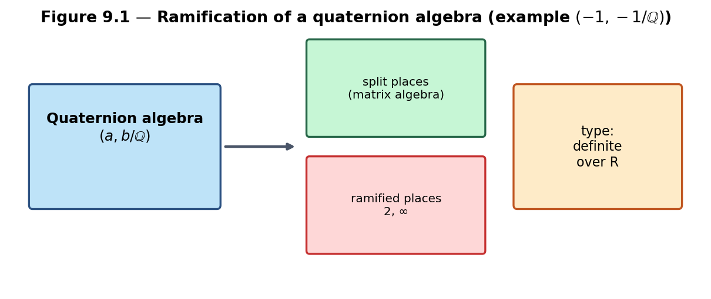
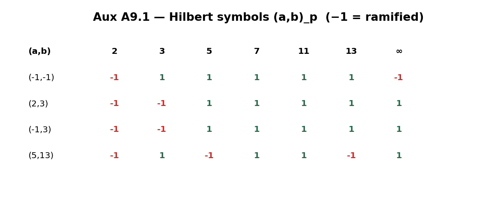
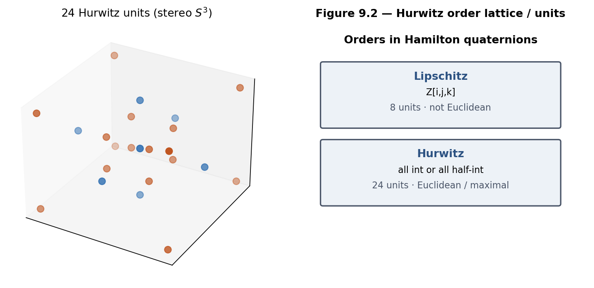
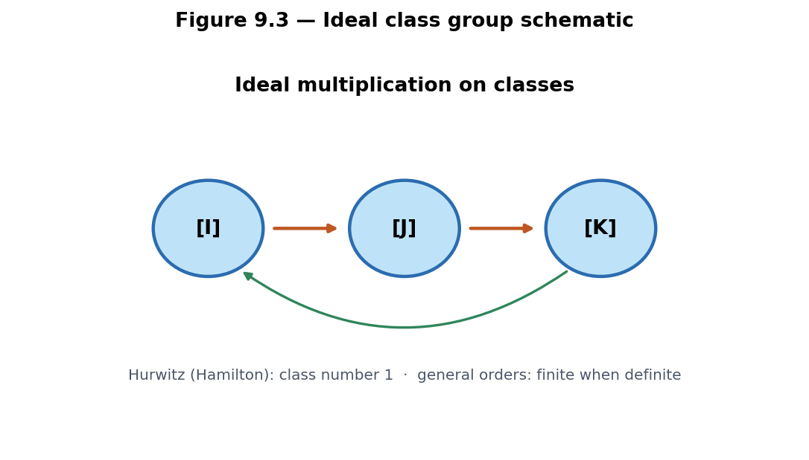
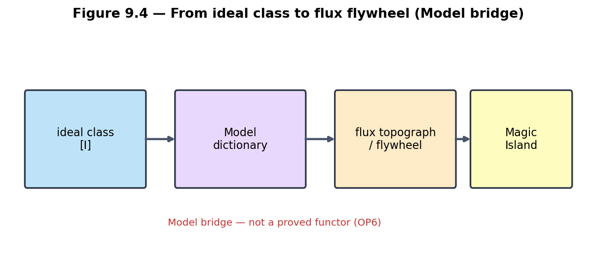
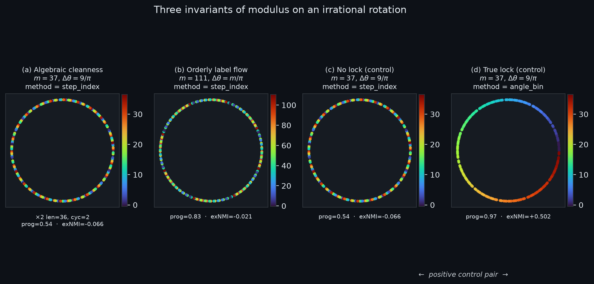

# Chapter 9 — Quaternion Algebras and Ideal Theory

This chapter supplies the rigorous algebraic foundation for the class-group analogues and composition laws of Chapter 8. We introduce quaternion algebras over \(\mathbb{Q}\), their orders (especially the Hurwitz order), and the ideal theory that turns equivalence classes of ideals into a group. This framework is the natural home for making the Model constructions of previous chapters more arithmetic and for attacking Open Problem 6 with algebraic tools.

**Learning goals**

1. Define quaternion algebras over \(\mathbb{Q}\) and understand ramification.  
2. Work with orders (Lipschitz, Hurwitz, maximal) and their ideal theory.  
3. See how ideal classes form a group and how this relates to the class-group analogues of Chapter 8.  
4. Connect ideal theory back to composition of forms / flywheels and to Magic Islands (**Model** dictionary).  
5. Prepare algebraic language for rigorous uniqueness and composition statements (OP6 and beyond).  
6. Separate **algebraic**, **sequential-label**, and **angle-lock** invariants when discrete moduli label continuous geometric orbits (supporting stack `vortex_math`).

**Figures in this chapter**

| Tag | File | Role |
|-----|------|------|
| Fig. 9.1 | `figures/fig9_1_quaternion_algebra.png` | Quaternion algebra ramification diagram |
| Fig. 9.2 | `figures/fig9_2_hurwitz_order.png` | Hurwitz order units / comparison |
| Fig. 9.3 | `figures/fig9_3_ideal_class_group.png` | Ideal class group schematic |
| Fig. 9.4 | `figures/fig9_4_ideal_to_flywheel.png` | Ideal class → flywheel (Model bridge) |
| Fig. 9.5 | `figures/fig9_5_modulus_invariants.png` | Three-layer modulus invariants (algebra · flow · lock control) |
| Aux A9.1 | `figures/aux9_1_ramification_table.png` | Hilbert-symbol ramification table |

**Claim discipline**

| Claim | Type |
|-------|------|
| Quaternion algebras, Hilbert symbols, Hurwitz Euclidean property, Hurwitz class number 1 | **Theorem** (classical) |
| Dictionary between ideal classes and flux topographs / Magic Islands | **Model** |
| Separation of modulus invariants on irrational rotations (algebra vs progression vs angle lock) | **Model** (experimentally controlled; not a theorem of TN) |
| `qga/lib/quaternion_algebra.py` helpers; external `vortex_math` metrics | **Software fact** |

---

## 9.1 Quaternion algebras over \(\mathbb{Q}\)

A **quaternion algebra** over \(\mathbb{Q}\) is a 4-dimensional central simple algebra over \(\mathbb{Q}\). Up to isomorphism, each is given by square-free integers \(a,b\neq 0\) via
\[
\Bigl(\frac{a,b}{\mathbb{Q}}\Bigr)
=
\mathbb{Q}+\mathbb{Q}i+\mathbb{Q}j+\mathbb{Q}ij,
\qquad
i^2=a,\; j^2=b,\; ij=-ji.
\]
The Hamilton algebra corresponds (over \(\mathbb{R}\)) to \(a=b=-1\); as an algebra over \(\mathbb{Q}\) one studies \(\bigl(\frac{-1,-1}{\mathbb{Q}}\bigr)\).

### Ramification

At each place \(p\) (finite prime or \(\infty\)), the local Hilbert symbol \((a,b)_p\in\{\pm 1\}\) detects whether the algebra is a division algebra (\(-1\), **ramified**) or isomorphic to \(M_2\) (**split**). The set of ramified places is finite and of even cardinality; it classifies the algebra.

```text
QuaternionAlgebra(a, b)
  .ramified_places()
  .is_definite()          # True iff ramified at ∞
  .hilbert_at(p)
```



*Figure 9.1.* Example \(\bigl(\frac{-1,-1}{\mathbb{Q}}\bigr)\): ramified at \(2\) and \(\infty\) (definite over \(\mathbb{R}\)).



*Auxiliary Figure A9.1.* Hilbert symbols for several \((a,b)\) at small places; red \(-1\) marks ramification.

**Claim type.** Classification by ramification sets and Hilbert symbols: **Theorem** (classical). Implementation in the book helper: **Software fact** (pedagogical, not a full number-theory library).

---

## 9.2 Orders in quaternion algebras

An **order** is a subring that is a full-rank \(\mathbb{Z}\)-lattice in the algebra. In the Hamilton setting:

| Order | Definition | Units | Euclidean? |
|-------|------------|-------|------------|
| Lipschitz | \(\mathbb{Z}[i,j,k]\) | 8 | No |
| Hurwitz | all-integer or all-half-integer coords | 24 | Yes (maximal) |

The Hurwitz order is preferred for arithmetic (Chapter 1 **Model** preference for lattice work; Euclidean algorithm is classical **Theorem**). Its unit group is the binary tetrahedral group—the set \(\Lambda_0\) of Chapter 3.



*Figure 9.2.* 24 Hurwitz units in stereographic \(S^3\), and Lipschitz vs Hurwitz comparison.

```text
HurwitzOrder().units          # 24
HurwitzOrder().is_euclidean() # True (classical fact)
HurwitzOrder().is_maximal()   # True (classical fact)
LipschitzOrder().n_units()    # 8
```

In general quaternion algebras, **maximal orders** play the role of rings of integers in number fields; different maximal orders need not be conjugate when the class number is nontrivial.

---

## 9.3 Ideal theory and class groups

One studies left ideals, right ideals, and two-sided ideals of an order. For **definite** quaternion algebras (ramified at \(\infty\)), the left ideal class set of a maximal order is finite. Ideal multiplication induces a group structure on (two-sided) ideal classes, and related class sets control representation of integers by norms of ideals.

### Hurwitz class number (classical)

The left ideal class number of the Hurwitz order is **1**: every left ideal is principal. The book helper reports this as a cited classical fact with a finite sample check of small-norm elements—not a full ideal enumeration.

```text
left_ideal_class_group(HurwitzOrder())
  → IdealClassGroupResult(order=1, method='classical_hurwitz_class_number_one', ...)
```



*Figure 9.3.* Ideal classes with multiplication. For Hurwitz, a single class; general definite orders may have larger finite class numbers.

**Claim type.** Finiteness for definite maximal orders; Hurwitz class number 1: **Theorem** (classical). Full algorithmic enumeration of ideals for general \((a,b)\): out of scope for this sandbox.

---

## 9.4 From ideals to flux topographs and flywheels (Model bridge)

Chapter 8 approximated class groups with composition of flux topographs. The natural dictionary is still a **Model**:

| Algebraic object | Geometric / Model object |
|------------------|--------------------------|
| Ideal in a quaternion order | Flux configuration / supporting cycle on the gauged Hopf lattice |
| Ideal class | Equivalence class of reduced flux topographs |
| Ideal class group | Class-group analogue of Chapter 8 |
| Norm of an ideal | Stability score or `magic_island_score` |
| Ideal multiplication | Composition of flywheels (when well-defined — OP6) |



*Figure 9.4.* Schematic Model bridge. Not a proved functor.

**Open Problem 6 (continued).**  
Use ideal theory of quaternion algebras to define a rigorous composition law on classes of flux configurations that is associative, gauge-compatible, and reduces to Gauss composition in suitable limits. Determine whether the resulting class group predicts Magic Island location and size.

```text
form_ideal_dictionary_entry()   # static dictionary for labs
class_group_analogue(...)       # Ch. 8 Model side
left_ideal_class_group(...)     # algebraic side (Hurwitz: order 1)
```

---

## 9.5 Modulus, invariants, and angle–label locking

*Supporting stack: [`vortex_math`](https://github.com/kinaar8340/vortex_math) · research note: [`notes/RESEARCH_NOTE_moduli.md`](../notes/RESEARCH_NOTE_moduli.md).*

Chapters 3–8 build discrete geometric objects (gauged Hopf lattice, flux topographs) whose **labels** and **equivalence classes** carry arithmetic meaning. Before those dictionaries become too ambitious, it is worth isolating a cleaner, lower-dimensional lesson: when symbolic patterns of Vortex Math—digital roots, the doubling circuit, and the privileged status of 3-6-9—are placed onto points generated by *continuous geometry* rather than discrete integer sequences alone, the choice of labeling modulus does **not** act as a single uniform operator. It modifies *different invariants* depending on how it is attached to the system.

### Geometric stage

Consider an irrational rotation on the unit circle whose step size is a fixed multiple of the circle constant:

\[
\theta_k = k \cdot \frac{9}{\pi} \pmod{2\pi}.
\]

Because \(9/\pi\) is an irrational multiple of \(2\pi\), the orbit is dense: successive points come arbitrarily close to every location on the circle without closing into a finite regular polygon. The factor **9** echoes the digital-root base of Vortex Math; **π** is the circle’s own constant. Geometry and numerology share the stage, but they are no longer forced to play the same role. (A coupled step \(\Delta\theta = m/\pi\) will appear below when the modulus is allowed to set the winding rate.)

### Three layers of invariant

**Algebraic structure of the doubling map.**  
Changing the modulus alters the cycle decomposition of repeated doubling on \(\mathbb{Z}/m\mathbb{Z}\). The value \(m = 37\) produces the cleanest long orbit: length 36 from 1, with 2 acting as a primitive root modulo 37. Composites built from 37—notably \(111 = 3 \times 37\) and \(333 = 9 \times 37\)—inherit this long cycle length but fragment it according to the Chinese Remainder Theorem. Algebraic “cleanness” is therefore strongest at the repunit prime **37**, the prime factor of the length-3 repunit \(R_3 = 111\).

**Orderly progression of labels along the geometric orbit.**  
When the rotational step itself is *coupled* to the modulus (\(\Delta\theta = m/\pi\)), labels advance with greater sequential coherence for certain composites. The value **111** frequently yields the highest scores for label progression and overall symmetry under this coupled regime. Here the modulus influences the *flow of labels relative to the accumulating points*, rather than the intrinsic algebraic cycles alone. Composite structure and winding rate interact; the prime-mover number 111 is not merely decorative in this layer.

**Positional angle–label locking.**  
Only one labeling method creates a genuine *statistical* dependence between label and actual geometric angle: explicit angular binning (`angle_bin`). Under the default sequential method (`step_index`)—labels from the step count and its digital root or modular residue—normalized mutual information between labels and angles remains at or below chance once a proper null model (label shuffling with the same marginals) is applied.

Apparent visual symmetry in sequential plots therefore reflects **orderly sequential progression**, not a hidden locking of labels to preferred angles on the circle. That outcome is precisely what one should expect from an irrational rotation labeled by step index: the orbit has no preferred angles unless the labeling method itself introduces angular bins by construction.



*Figure 9.5.* **(a)** Algebraic cleanness: \(m=37\), fixed step \(9/\pi\), sequential labels—long clean \(\times 2\) structure.  
**(b)** Orderly label flow: \(m=111\), coupled step \(m/\pi\), sequential labels—higher label-progression along the orbit.  
**(c)–(d)** Positive control pair at \(m=37\): sequential labeling yields excess NMI at or below the shuffle null; angular binning yields strongly positive excess NMI. Visual order under step-index is progression, not positional lock.  
*(Supporting generation: `vortex_math` · `assets/book_figure_three_layers.png`.)*

### Controls and claim type

These layers were separated by controlled comparisons of mapping methods, step modes, and quantitative metrics: excess normalized mutual information (**exNMI**) against permutation baselines, label-progression scores, and angular uniformity. A positive control seals the analysis: when labels *are* angle bins, exNMI is strongly positive and many standard deviations above the null; when labels are step indices, exNMI is not.

**Claim type.** The three-layer separation and control are a **Model** for how arithmetic moduli interact with geometric orbits in this book’s ecosystem—experimentally reproducible, not a classical theorem of Hatcher *Topology of Numbers*. Implementation and full tables: **Software fact** (`vortex_math` repo; note in `notes/RESEARCH_NOTE_moduli.md`).

### Takeaway for the QGA spine

The practical consequence is concise:

> **Modulus changes the algebraic and sequential-label invariants; it does not create angle–label locking on an irrational rotation unless you label by angle itself.**

This distinguishes synchronicity that arises from composite number structure—notably **111** as prime-mover composite \(3 \times 37\)—from stronger geometric claims that would require explicit angular construction. Algebra crowns 37; coupled progression frequently crowns 111 under the \(m/\pi\) regime; true positional locking belongs only to labeling methods that bin explicitly by angle.

For the rest of the book: when Chapters 5–8 speak of “labels,” “classes,” and “Magic Islands,” the same discipline applies—**name which invariant you are measuring**. Ideal class groups (§9.3–9.4) are algebraic invariants; flux scores and topograph diagrams are geometric or Model-level; statistical lock to a continuous base space is a third claim, and must be tested against a null, not inferred from visual order alone.

```text
# External supporting stack (not vendored in lib/)
~/Projects/vortex_math
  python src/main.py --family-37 --num-steps 200
  python src/main.py --resonance-scan --method step_index --num-steps 600
  python src/main.py --resonance-scan --method angle_bin --num-steps 600
```

---

## 9.6 First computational labs

Helpers: `lib/quaternion_algebra.py` · **Appendix C §C.4**.

- **9.A** `QuaternionAlgebra(-1,-1).ramified_places()`.
- **9.B** Hurwitz: 24 units, Euclidean, maximal.
- **9.C** `left_ideal_class_group` → class number 1 (cited classical).
- **9.D** Compare algebraic order 1 vs Model `class_group_analogue` order.
- **9.E** Hilbert symbols table.
- **9.F (optional, external)** Run the `vortex_math` resonance control: `step_index` vs `angle_bin` and record exNMI signs.

```python
from lib.quaternion_algebra import QuaternionAlgebra, HurwitzOrder, left_ideal_class_group
print(QuaternionAlgebra(-1, -1).ramified_places())
print(HurwitzOrder().n_units(), left_ideal_class_group().order)
```


---

## Exercises

**9.A (hand).** Define a quaternion algebra over \(\mathbb{Q}\) and state what ramification means.

**9.B (hand).** Why is the Hurwitz order preferred over the Lipschitz order for most arithmetic work?

**9.C (code).** Complete Labs 9.A–9.B. Confirm 24 Hurwitz units and Euclidean / maximal flags.

**9.D (code).** Run Lab 9.C. What class number do you obtain for Hurwitz, and what does the `method` string say?

**9.E (code).** Complete Lab 9.D. Compare algebraic class number \(1\) with the Model `class_group_analogue` order. Why can they differ?

**9.F (Hatcher bridge).** In Hatcher Chapter 8, forms correspond to ideals. Sketch how §9.4’s dictionary might be made precise for a quaternion order (even if only conjecturally).

**9.G (Open Problem 6).** Using Hurwitz class number 1, what would a *successful* OP6 composition law look like when restricted to configurations “coming from” principal ideals? What obstructions remain for non-principal classes in other algebras?

**9.H (forward).** Why will Chapter 10’s observational validation benefit from a rigorous ideal-theoretic home for class-group analogues?

**9.I (software honesty).** Distinguish: (i) classical ideal class groups (**Theorem**), (ii) `left_ideal_class_group` toy report (**software** citing theorem), (iii) Ch. 8 `class_group_analogue` (**Model**).

**9.J (modulus invariants).** In section 9.5, name the three layers (algebra / progression / angle lock). Which modulus wins algebraic cleanness? Which often wins progression under \(m/\pi\)? Why is positive exNMI under `angle_bin` a *control*, not a discovery about \(m=37\)?

**9.K (code, external).** If `~/Projects/vortex_math` is available, run Lab 9.F and report exNMI under `step_index` vs `angle_bin` for \(m\in\{9,37,111\}\).

---

## Code and asset pointers

```text
qga/lib/quaternion_algebra.py
  QuaternionAlgebra, hilbert_symbol,
  HurwitzOrder, LipschitzOrder,
  left_ideal_class_group, form_ideal_dictionary_entry

qga/lib/composition.py
qga/lib/hopf_lattice.py   # HURWITZ_UNITS shared with Ch. 3

# Supporting stack (external)
~/Projects/vortex_math/          # active development
qga/lib/vortex_math/README.md    # pointer into this book’s tree
qga/notes/RESEARCH_NOTE_moduli.md
```

**Figures:** `scripts/generate_ch9_figures.py` · Fig. 9.5 from `vortex_math` book figure  
**Open problems:** OP6 (composition via ideal theory); OP1–OP3 for the geometric side of the dictionary.  
**Research note:** `notes/RESEARCH_NOTE_moduli.md`

---

## Looking ahead

We now have the algebraic backbone—quaternion algebras, orders, and ideal class groups—that can host rigorous versions of the Model constructions in Chapters 5–8, together with a controlled lesson on **which invariant a modulus is measuring** when discrete labels meet continuous orbits. In **Chapter 10** we return to the observational layer: statistical protocols for \(350/\pi\), the \(Z\mapsto\) map, Magic Islands, and any class-group predictions that become precise enough to test—always distinguishing algebraic claims, Model dictionaries, and empirical lock statistics.

With the ideal-theoretic foundation in place, the full construction is ready for observational scrutiny.

---

*Manuscript · Part IV · Chapter 9 · Figures in `book/figures/` · Helpers: `lib/quaternion_algebra.py` · Supporting: `vortex_math`.*
