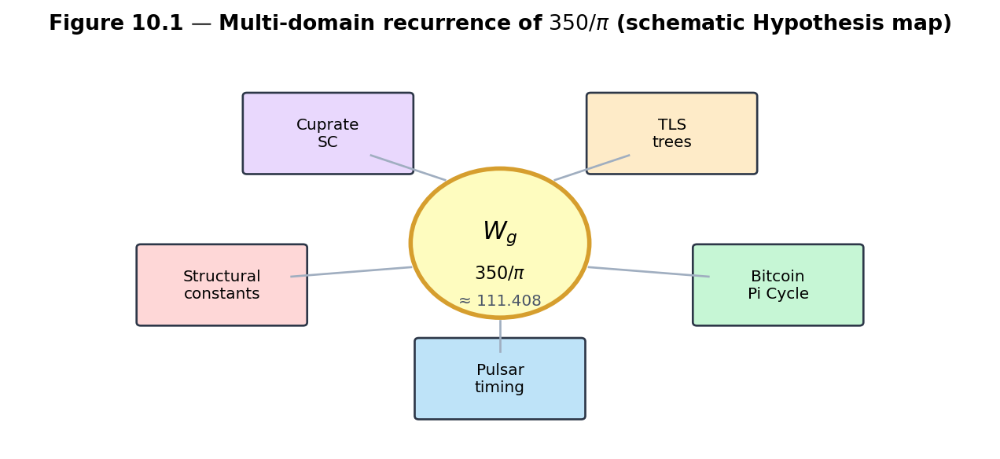
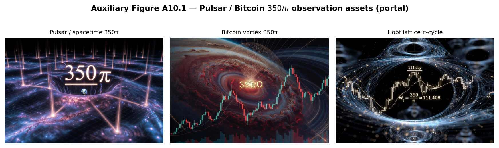
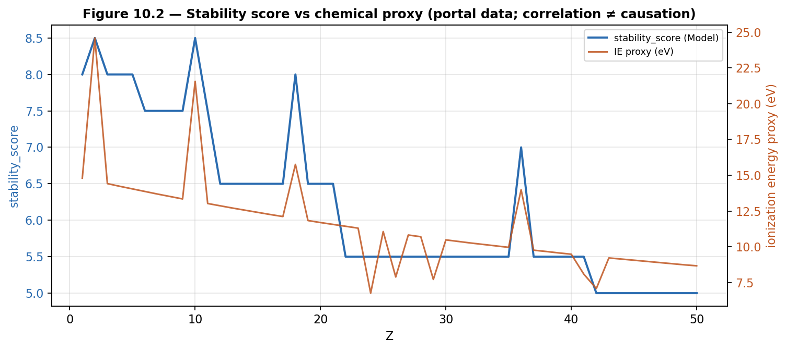
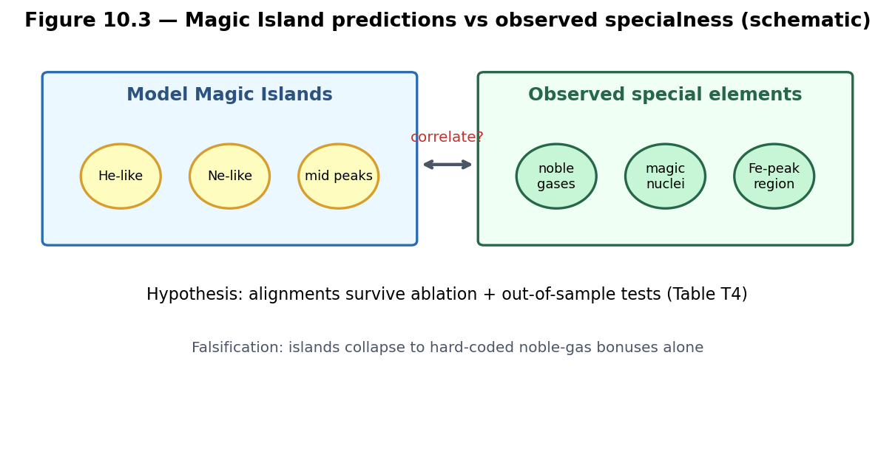
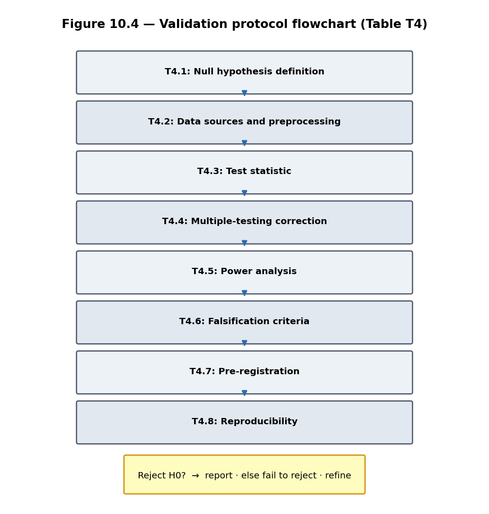

# Chapter 10 — Observations, Hypotheses, and Validation

This chapter collects the observational layer of the Kingdom Come Model. It presents the recurring numerical signature \(W_g = 350/\pi\), the \(Z\mapsto\) flux map correlations, Magic Island alignments, and other multi-domain patterns. All claims here are labeled explicitly as **Model** or **Hypothesis**, and the chapter supplies concrete validation protocols (Table **T4**) so that the construction can be tested, refined, or falsified.

**Learning goals**

1. Review the major observational signatures that motivated the project.  
2. Distinguish Model statements from testable Hypotheses.  
3. Apply the validation protocols to the \(350/\pi\) signature and the \(Z\mapsto\) map.  
4. Summarize the status of all Open Problems.  
5. Provide a clear roadmap for future empirical work.

**Figures in this chapter**

| Tag | File | Role |
|-----|------|------|
| Fig. 10.1 | `figures/fig10_1_350_over_pi_domains.png` | Multi-domain recurrence of \(350/\pi\) |
| Fig. 10.2 | `figures/fig10_2_z_map_correlation.png` | Stability score vs chemical proxy |
| Fig. 10.3 | `figures/fig10_3_magic_island_validation.png` | Islands vs observed specialness |
| Fig. 10.4 | `figures/fig10_4_validation_flowchart.png` | Validation protocol (Table T4) |
| Aux A10.1 | `figures/aux10_1_pulsar_bitcoin_overlay.png` | Pulsar / Bitcoin observation assets |

**Claim discipline (throughout the book)**

| Label | Meaning |
|-------|---------|
| **Theorem** | Proved here or classical |
| **Model** | Consistent mathematical or physical construction, not claimed as nature’s unique law |
| **Hypothesis** | Observational claim needing validation or falsification |

---

## 10.1 The major observational signatures

The Kingdom Come project was motivated by several recurring numerical and structural patterns:

- The constant
  \[
  W_g = \frac{350}{\pi} \approx 111.408
  \]
  (`WG_FROM_350_OVER_PI` in Kingdom Come / book helper `WG_350_OVER_PI`) appearing across pulsar-timing narratives, Bitcoin Pi Cycle notes, TLS tree analysis, cuprate sketches, and structural constants.  
- Alignment of high `stability_score` regions (Magic Islands) with noble-gas \(Z\) and selected mid-table elements.  
- Topological protection (linked Hopf fibers) as a geometric language for stability that classical elementary number theory only hints at.

These patterns live in the portal **Observations** tab and in `kingdom/observations/`.



*Figure 10.1.* Domains associated with the \(W_g=350/\pi\) signature in the observation program (schematic).

**Claim type.** Raw portal constants and plotted observation assets: **software / project facts**. The claim that they share a single topological clock: **Hypothesis** (OP5).



*Auxiliary Figure A10.1.* Portal observation assets (pulsar spacetime \(350\pi\), Bitcoin vortex / lattice π-cycle). Visual motivation only—not a completed statistical test.

---

## 10.2 The \(Z\mapsto\) flux map — current status

Chapter 7 defined
\[
Z \mapsto \bigl(\text{flywheel state},\;\texttt{stability\_score},\;\texttt{stability\_class},\;\ldots\bigr)
\]
via `map_z_to_flywheel` / `map_z_to_flywheel_extended`. Outputs show peaks near noble-gas \(Z\) and partial alignment with ionization-energy proxies in extended fields.



*Figure 10.2.* Portal `stability_score` vs an IE proxy across \(Z\). **Correlation is not causation**; ablation and out-of-sample tests are required (Table T4).

**Claim type.** Reproducible curves from the current implementation: **Software fact**. Physical emergence of the periodic table: **Model** / **Hypothesis**.

**Open Problem 4 (recap).** Up to gauge, is the \(Z\mapsto\) flywheel map unique under stated axioms? See Chapter 7 and `notes/open_problems.md`.

---

## 10.3 Magic Islands and chemical/nuclear specialness

Magic Islands (Chapters 5–6) appear as regions of high periodicity, controlled variance, and high `stability_score` / `magic_island_score`. Some coincide with elements that are chemically or nuclearly special.



*Figure 10.3.* Model islands vs observed special classes (schematic). Encouraging correlation inside the working Model—not yet derived from first principles.

**Falsification sketch.** If ablating explicit noble-gas bonuses removes all predictive alignment with held-out properties, the “emergence” reading of islands fails the Table T4 protocol for that claim.

---

## 10.4 Summary of Open Problems

| # | Problem | Home | Status (one line) |
|---|---------|------|-------------------|
| OP1 | Canonical quaternionic Farey | Ch. 3 | Open — `candidate_adjacency` |
| OP2 | Flux topograph axioms | Ch. 5 | Open — `flux_topograph` |
| OP3 | Class number ↔ Magic Island | Ch. 6 | Open — heuristic |
| OP4 | \(Z\to\) flywheel uniqueness | Ch. 7 / 10 | Open |
| OP5 | \(350/\pi\) first principles / falsify | Ch. 10 | Open — Table T4 |
| OP6 | Flywheel composition (Gauss lift) | Ch. 8–9 | Open — low sandbox closure |

**Full statements, sandboxes, success criteria, and dependency sketch:** **Appendix B**.  
Helpers: `lib.validation.open_problems_status_table()`.

---

## 10.5 Validation protocols (Table T4)

A pre-registered validation checklist for major hypotheses. **Full protocol, hypothesis catalog, and statistical helpers:** **Appendix D**.

**Eight elements (names only):** null definition · data sources · test statistic · multiple testing · power · falsification · pre-registration · reproducibility.

```python
from lib.validation import table_t4_checklist, default_hypotheses, run_table_t4_demo
print(len(table_t4_checklist()), [h.name for h in default_hypotheses()])
demo = run_table_t4_demo(seed=1, alpha=0.01)  # toy null — not evidence for 350/π
print(demo["decision"], demo["disclaimer"])
```



*Figure 10.4.* High-level Table T4 decision tree (details in Appendix D).

**Claim type.** Existence of the protocol and helpers: **Software fact**. “Hypothesis \(X\) passed T4”: **Hypothesis** until the full checklist is executed and reviewed.

**Open Problem 5.** Derive \(W_g=350/\pi\) from lattice geometry, **or** falsify multi-domain recurrence via pre-registered tests (Appendix D / Table T4).

---

## 10.6 Summary of the entire construction

**Parts I–II (Chapters 1–4)** built the geometric foundation: quaternions, the Hopf fibration, the gauged Hopf lattice, and its symmetries—the higher-dimensional lift of Hatcher’s Farey diagram.

**Part III (Chapters 5–7)** developed the visual and representation-theoretic core: flux topographs, classification and Magic Islands, and the \(Z\mapsto\) flux map.

**Part IV (Chapters 8–9)** supplied arithmetic depth: composition, class-group analogues, and quaternion algebra / ideal theory as a rigorous home for those analogues.

**Part V (this chapter)** returns to observation and validation, closing the loop between geometry, arithmetic, and empirical patterns.

Every major claim is labeled so readers can separate theorems, models, and hypotheses.

---

## 10.7 Outlook and invitation

The six Open Problems are the main research edges. Advances on **OP1** (canonical adjacency), **OP2** (topograph axioms), or **OP6** (associative composition via ideal theory) especially strengthen the whole framework.

Validation can proceed incrementally: a documented failure to reject the null for \(350/\pi\) in one domain, or a refined class-number invariant with better island prediction, both count as progress.

The [qga](https://github.com/kinaar8340/qga) repository and Kingdom Come portal remain open for extension—including optional Gradio “Book Mode” and future composition / validation dashboards.

---

## Exercises (final chapter)

**10.A (hand).** Using **Appendix B**, choose OP1, OP2, or OP6 and write a one-page research proposal: sandbox, diagnostic, and success criterion.

**10.B (code).** Using **Appendix D** / `run_table_t4_demo`, run under the null toy generator and with hand-chosen \(p\)-values. Report Bonferroni threshold, Fisher combined \(p\), and decision. Toy data are **not** evidence for \(350/\pi\).

**10.C (code).** Using `proximity_to_wg` (Appendix D), measure closeness of a few constants to \(350/\pi\). Diagnostic only, not a significance test.

**10.D (forward).** If OP6 were solved with an associative law from ideal multiplication, what new prediction about Magic Islands or the \(Z\mapsto\) map could be tested under Table T4?

**10.E (philosophical).** In one paragraph, explain why Theorem / Model / Hypothesis labeling is essential for a project at the intersection of pure mathematics and speculative physics.

**10.F (project).** Open `default_hypotheses()` and add one new `HypothesisSpec` for a domain you care about, with null, falsification, and data sources.

---

## Code and asset pointers

```text
qga/lib/validation.py
Appendix B (Open Problems) · Appendix D (Table T4 full)
Appendix C §C.4 (lab listings)
kingdom/observations/ · kingdom.core.flux_flywheel
```

**Figures:** `scripts/generate_ch10_figures.py` · **Appendix E** (atlas)  
**Related portal:** Observations tab; Flux Flywheel.

---

## Closing

This book has attempted to lift Allen Hatcher’s visual, geometric approach to number theory into the richer world of quaternions and the Hopf fibration, while labeling every claim carefully. The result is a coherent framework connecting classical number theory, topology, and a speculative model of emergent physics.

Whether the Model survives empirical scrutiny is now a question for systematic validation. The tools in Chapters 1–9 and the protocols in this chapter are designed to make that question answerable.

---

*Manuscript · Part V · Chapter 10 (final) · Figures in `book/figures/` · Helpers: `lib/validation.py` · OP5 · Table T4.*
